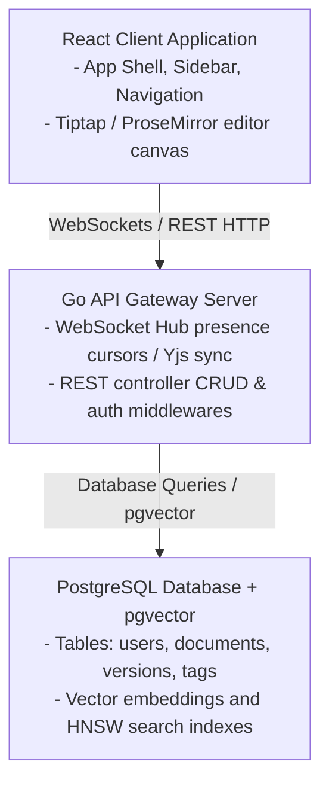

# Technical Design: System Architecture Overview

Kollab is a lightweight knowledge management platform featuring a block-based collaborative canvas, a backend plugin engine, and semantic search capabilities.

---

## 1. System Components & High-Level Flow

> [!NOTE]
> **Status:** 🟢 Completed



---

## 2. Core Stack Specifications

> [!NOTE]
> **Status:** 🟢 Completed

*   **Frontend**: React (MUI v9 client styles) utilizing Tiptap editor engine and ProseMirror document framework.
*   **Backend**: Go REST/WebSocket server using `chi` router and Gorilla WebSocket pumps.
*   **Database**: PostgreSQL 16 (with `pgvector` container extension for vector HNSW distance checks).
*   **Local LLM Embeddings**: Ollama service executing the `nomic-embed-text` (768-dimension) model.

---

## 3. Database Schema

> [!NOTE]
> **Status:** 🟢 Completed

```sql
CREATE EXTENSION IF NOT EXISTS "uuid-ossp";
CREATE EXTENSION IF NOT EXISTS vector;

-- Documents table containing parent-child navigation mapping
CREATE TABLE documents (
    id UUID PRIMARY KEY DEFAULT uuid_generate_v4(),
    title VARCHAR(255) NOT NULL,
    content TEXT NOT NULL,                -- ProseMirror JSON document string
    project_id VARCHAR(50) NOT NULL,
    parent_id UUID REFERENCES documents(id) ON DELETE SET NULL,
    embedding vector(768),                -- 768-dim nomic-embed-text vectors
    created_at TIMESTAMP WITH TIME ZONE DEFAULT CURRENT_TIMESTAMP,
    updated_at TIMESTAMP WITH TIME ZONE DEFAULT CURRENT_TIMESTAMP
);

-- HNSW Vector Index for Cosine Similarity Searches
CREATE INDEX idx_documents_embedding ON documents USING hnsw (embedding vector_cosine_ops);
```

---

## 4. 12-Month Gantt Roadmap

> [!NOTE]
> **Status:** 🟢 Completed

*   **Q1: CRUD API & Auth Middleware**: SQLite & Postgres schema migrations, JWT/Logto OIDC JWKS token validation, team workspace scoping.
*   **Q2: Collaborative Editor Shell**: Tiptap headless canvas bindings, WebSocket roomRelay handlers, cursor presence, Yjs synchronization updates, toolbar layout adjustments.
*   **Q3: Hybrid Search & Versioning**: `pgvector` HNSW indexes, Ollama http embedding client, debounced versions, Named milestones, Global Search Page (`/search`), History drawers.
*   **Q4: Rich Content Blocks**: Callout panels, status badges, expandable blocks, export integrations (PDF/Word), metrics dashboards.

---

## 5. Centralized Theming & Design System

> [!NOTE]
> **Status:** ⚪ Planned

To ensure visual consistency and brand alignment across all pages, presentations, and macros, Kollab implements a robust token-based Theming Engine. 

Administrators can define a `ThemeConfig` payload that controls:
- Light and Dark mode palettes.
- Typography styles for headings, body, and monospace code.
- Shape variables (e.g., border radii for rounded vs square corners).

For detailed specifications on how CSS variables are injected and inherited by isolated Shadow DOM plugins, please refer to **[13_theming_and_design_system.md](13_theming_and_design_system.md)**.

---

## 6. Centralized Telemetry & Audit Logging

> [!NOTE]
> **Status:** ⚪ Planned

To meet enterprise compliance requirements, Kollab implements a structured logging interface (e.g., via `slog` or `zap`) capable of multiplexing application telemetry and audit events to external cloud aggregators.

### 6.1 Supported Adapters
1. **AWS CloudWatch**: Streams JSON-structured application and audit logs to a designated AWS Log Group.
2. **Azure Log Analytics**: Streams logs to an Azure Workspace ID via the Data Collector API.
3. **Local Standard Out (stdout)**: The default behavior, relying on the host OS or Docker daemon to capture logs.

### 6.2 Telemetry Configuration UI
Administrators manage these integrations via the System Administration dashboard (`/admin/telemetry`), allowing them to input their Workspace IDs or AWS Log Group ARNs dynamically without rebooting the server.
