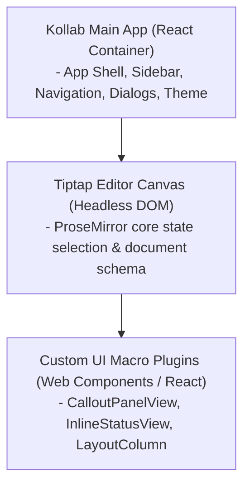
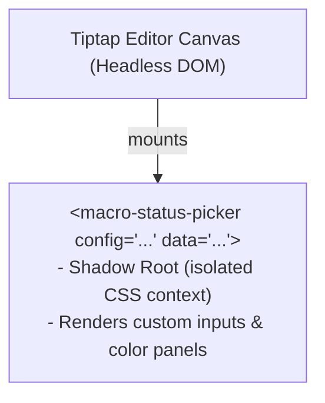

# Technical Design: Editor Canvas, Collaboration, & Presence

This document details the architecture, configurations, and collaborative sync loop of the Tiptap/ProseMirror editor canvas in Project Kollab, as well as read-only editing states and document statistics.

## Local development endpoint

The Vite development server is configured for `http://localhost:8090` with `strictPort: true`. The Go server's local authentication configuration, CORS allowlist, Docker development environment, and Playwright base URL use the same browser origin. The API and WebSocket proxy use host port `8081`; the Go service continues to listen on port `8080` inside Docker.

`dev.sh` is the repository launcher for this composition. It first probes the active Docker context with `docker info`. If the daemon is unavailable and the `colima` executable exists, the launcher synchronously runs `colima start`; otherwise, it exits with instructions to start Docker. It then resolves the supported Docker Compose command, runs `docker-compose.dev.yml` in detached mode, installs frontend dependencies only when absent, and uses `exec npm run dev` so the terminal is attached to Vite. `dev.sh --down` delegates cleanup to Docker Compose; interrupting Vite does not stop the development containers.

---

## 1. Tiptap & ProseMirror Core Architecture

> [!NOTE]
> **Status:** 🟢 Completed

Kollab utilizes a headless editor model where the DOM is managed React-declaratively, while the underlying document model is tracked as a ProseMirror Abstract Syntax Tree (AST).



### 1.1 Core Extensions
The editor canvas integrates several native Tiptap extensions to provide foundational rich text capabilities:
* **Standard Formatting**: Bold, Italic, Strikethrough, Underline, Highlight, Subscript, Superscript, Code, Text Align, Blockquote.
* **Text Styles**: The `TextStyle` and `Color` extensions enable arbitrary text color hex properties to be stored directly in the document AST.
* **Hyperlinks**: The `Link` extension maintains URL mapping across the AST, with a custom-built floating action menu and Insert Link dialog handling the user experience.

### 1.2 Document AST Structure
ProseMirror represents documents as a nested node tree (JSON) rather than flat HTML, which guarantees structured data validation and seamless operational transformation (OT) mapping:

```json
{
  "type": "doc",
  "content": [
    {
      "type": "heading",
      "attrs": { "level": 1 },
      "content": [
        { "type": "text", "text": "Product Roadmap Q3/Q4" }
      ]
    },
    {
      "type": "paragraph",
      "content": [
        { "type": "text", "text": "This is a collaborative document." }
      ]
    }
  ]
}
```

---

## 2. Collaborative Syncing Loop (Yjs & WebSockets)

> [!NOTE]
> **Status:** 🟢 Completed

Real-time multi-user editing is achieved by anchoring Tiptap's collaboration extension to a shared **Yjs document (`Y.Doc`)** synced over a WebSocket network loop.

### 2.1 Sync Architecture

```
Client A (Y.Doc) <──[WS binary updates]──> Go WebSocket Hub ──> Client B (Y.Doc)
       │                                                              │
       ▼ (local update)                                               ▼ (local update)
Tiptap Editor A                                                Tiptap Editor B
```

1. **State updates**: Any change in Client A’s Tiptap editor is captured as an incremental update transaction in the local `Y.Doc`.
2. **Offline Persistence (`y-indexeddb`)**: Before transmission, the transaction is saved locally to the browser's IndexedDB. This guarantees no data is lost if the internet drops.
3. **Websocket relay**: The transaction updates are serialized into binary blobs, base64 encoded, and transmitted to the Go backend WebSocket server using the `sync` message type.
4. **Broadcast**: The Go backend stores the cumulative base64 updates in-memory (and in `document_versions` during debounced snapshots) and broadcasts the updates to all other connected clients in the same document room.
5. **Integration**: Client B receives the updates, applies them to their local `Y.Doc`, and the collaboration extension updates the Tiptap editor state seamlessly.

### 2.2 WebSocket Communication Payloads

WebSockets handle Yjs syncing and presence messages. The Go backend router accepts connections at `/api/ws`.

#### Client-to-Server Messages
- **Join room**:
  ```json
  {
    "type": "join",
    "docId": "doc_welcome_eng"
  }
  ```
- **Sync document state (Yjs update blob)**:
  ```json
  {
    "type": "sync",
    "docId": "doc_welcome_eng",
    "update": "AQJ4...[Base64 encoded Yjs update binary]..."
  }
  ```

#### Server-to-Client Messages
- **Initial Sync History**:
  Sent immediately upon registration to bootstrap a new client's editor canvas.
  ```json
  {
    "type": "sync-history",
    "docId": "doc_welcome_eng",
    "updates": [
      "AQJ4...",
      "AgK2..."
    ]
  }
  ```
- **Presence List**:
  Broadcast to all room occupants when clients join or leave.
  ```json
  {
    "type": "presence",
    "docId": "doc_welcome_eng",
    "users": [
      { "userId": "sh4ag0cxowti", "username": "John Doe", "color": "#8b5cf6" },
      { "userId": "mock-user-id", "username": "Alice Smith", "color": "#3b82f6" }
    ]
  }
  ```

---

## 3. Remote Cursor & Selection Presence

> [!NOTE]
> **Status:** 🟢 Completed

To track cursor positions and selections in real-time, Kollab implements a custom ProseMirror plugin: [PresenceCursors](../frontend/src/editor/extensions/PresenceCursors.ts).

### 3.1 Cursors Coordination Flow
1. **Local Selection Listener**: The client tracks cursor changes via `onSelectionUpdate` or keyboard/pointer interactions.
2. **WebSocket Broadcast**: A coordinates payload containing selection index boundaries is sent:
   ```json
   {
     "type": "cursor",
     "docId": "doc_welcome_eng",
     "position": 124,
     "anchor": 128
   }
   ```
3. **State Mapping**: Upon receiving peer cursor notifications, the custom extension feeds meta information into the ProseMirror transaction:
   ```typescript
   tr.setMeta("presence-cursor", { userId, username, color, position, anchor });
   ```
4. **Decoration Rendering**: The plugin maps positions to active coordinates, drawing:
   - **Inline highlight ranges** (from `anchor` to `position`) styled with transluscent colors (`${color}33`).
   - **Caret line widgets** styled with the peer user's color.
   - **Hover Labels** displaying the editor username temporarily.

---

## 4. Shadow DOM UI Macro Plugin Architecture

> [!NOTE]
> **Status:** 🟢 Completed

Kollab allows runtime loading of dynamic macros and custom widgets via a **Shadow DOM Web Components** model. This provides complete isolation, ensuring CSS stylesheets from plugins cannot pollute the core application design.



### 4.1 Lifecycle of Runtime Plugins
1. **Plugin Storage**: Plugin scripts are stored in the asset storage layer and registered in the database.
2. **Client Script Mounting**: When loading a document, active script elements are injected:
   ```javascript
   const script = document.createElement("script");
   script.src = "https://cdn.kollab.internal/plugins/status-badge.js";
   document.head.appendChild(script);
   ```
3. **Web Component Definition**: The custom plugin script registers a standard Custom Element:
   ```javascript
   customElements.define("macro-status-badge", class extends HTMLElement { ... });
   ```
4. **Editor Mapping**: Tiptap maps its internal node schemas (e.g. `MacroBlock`) to render corresponding HTML nodes:
   ```typescript
   renderHTML({ HTMLAttributes }) {
     return ["macro-status-badge", mergeAttributes(HTMLAttributes)];
   }
   ```

---

## 5. Editable State Synchronization

> [!NOTE]
> **Status:** 🟢 Completed

The editing state is managed by the React host state `isEditing: boolean` inside [EditorCanvas.tsx](../frontend/src/components/EditorCanvas.tsx).

When `isEditing` changes, it is synchronized with the ProseMirror/Tiptap instance via `editor.setEditable(isEditing)` within a React `useEffect`:

```typescript
// Synchronize state with Tiptap
useEffect(() => {
  if (editor && !editor.isDestroyed) {
    editor.setEditable(isEditing);
  }
}, [editor, isEditing]);
```

ProseMirror dynamically updates the host DOM element attributes, setting `contenteditable="true"` or `contenteditable="false"` accordingly.

### 5.1 Editor Layout: Sticky Header
The Editor is housed in the `EditorCanvas` component, which manages a highly optimized scroll layout. The `EditorHeader` (title, author, metadata) and the `EditorToolbar` (formatting tools) are wrapped in a sticky container (`position: "sticky", top: 0, zIndex: 10`), keeping the essential document controls and context visible at all times as the user scrolls down long documents.

---

## 6. CSS Contenteditable Selectors

> [!NOTE]
> **Status:** 🟢 Completed

In order to avoid messy class additions, we leverage ProseMirror's native state indicator attribute (`contenteditable`) in our stylesheet [index.css](../frontend/src/index.css):

* **Editing Layout Guides**:
  ```css
  .ProseMirror[contenteditable="true"] .layout-column {
    border: 1px dashed rgba(255, 255, 255, 0.08);
    background: rgba(255, 255, 255, 0.01);
  }
  ```
* **Seamless Read-Only Presentation**:
  ```css
  .ProseMirror[contenteditable="false"] .layout-column {
    border: 1px solid transparent;
    padding: 0;
    background: transparent;
  }
  ```

---

## 7. Node View Guards

> [!NOTE]
> **Status:** 🟢 Completed

Custom React Node Views (such as [CalloutPanelView.tsx](../frontend/src/components/CalloutPanelView.tsx) or [ImageComponent.tsx](../frontend/src/components/ImageComponent.tsx)) receive the parent `editor` as a prop in `NodeViewProps`.

To lock down views:
1. **Action Bars**: Action headers, floating grids, or delete buttons are wrapped in `{editor?.isEditable && ( ... )}` to prevent them from mounting at all.
2. **Interaction Handlers**: Click and double-click actions check `if (!editor?.isEditable) return;` at entry.
3. **Cursor Accents**: CSS selectors within the node wrapper alter `cursor: isEditable ? "pointer" : "default"` and remove hover border animations.

---

## 8. Page Analytics Algorithm

The read-only `EditorHeader` receives the canvas analytics state setter through the `setAnalyticsDialogOpen` prop. Selecting **Analytics** sets `analyticsOpen`, mounts `EditorAnalyticsDialog`, and fetches live document analytics for the active document. Keeping this prop name aligned with `EditorHeaderProps` is required: a mismatched prop leaves the header control without a callable state transition.

> [!NOTE]
> **Status:** 🟢 Completed

To compute structural statistics recursively, the page analytics reader parses the editor's JSON node output rather than parsing raw text.

The parser traverses the content tree:

```typescript
const visit = (node: any) => {
  if (node.type === "paragraph") paragraphs++;
  else if (node.type === "heading") headings++;
  else if (node.type === "table") tables++;
  else if (node.type === "customImage" || node.type === "image") images++;
  else if (node.type === "calloutPanel") callouts++;
  else if (node.type === "inlineStatus") statuses++;
  else if (node.type === "inlineDate") dates++;
  else if (node.type === "taskItem") tasks++;
  
  if (node.content) {
    node.content.forEach(visit);
  }
};

editor.getJSON().content?.forEach(visit);
```

This ensures block-level elements nested deep inside custom columns or tables are counted accurately.
Word counts are calculated by cleaning and splitting the plaintext output of `editor.getText()`.
Est. Reading Time assumes a standard adult reading pace of 200 words per minute.

---

## 9. Presentation Mode (Deck Viewer)

> [!NOTE]
> **Status:** ⚪ Planned

A toggle to instantly convert a standard scrolling Kollab document into a full-screen, paginated slide deck, ideal for town halls or project pitches.

### 9.1 Mode Trigger and Layout
- **Toggle**: Users can click a "Present" button in the document header.
- **Rendering**: The React host wrapper transitions from a vertical scroll container to a horizontal, full-viewport slider component.

### 9.2 Slide Pagination Logic
The engine paginates the document's AST dynamically based on two delimiter rules:
1.  **Heading 1 Break**: Every `heading` node with `level: 1` automatically signals the start of a new slide.
2.  **Manual Slide Break Macro**: Authors can insert a `<slideBreak>` macro anywhere in the document to force a break. 

The viewer then renders only the chunk of AST nodes that fall between the active slide's delimiters, providing a clean, focused presentation without altering the underlying document state.
