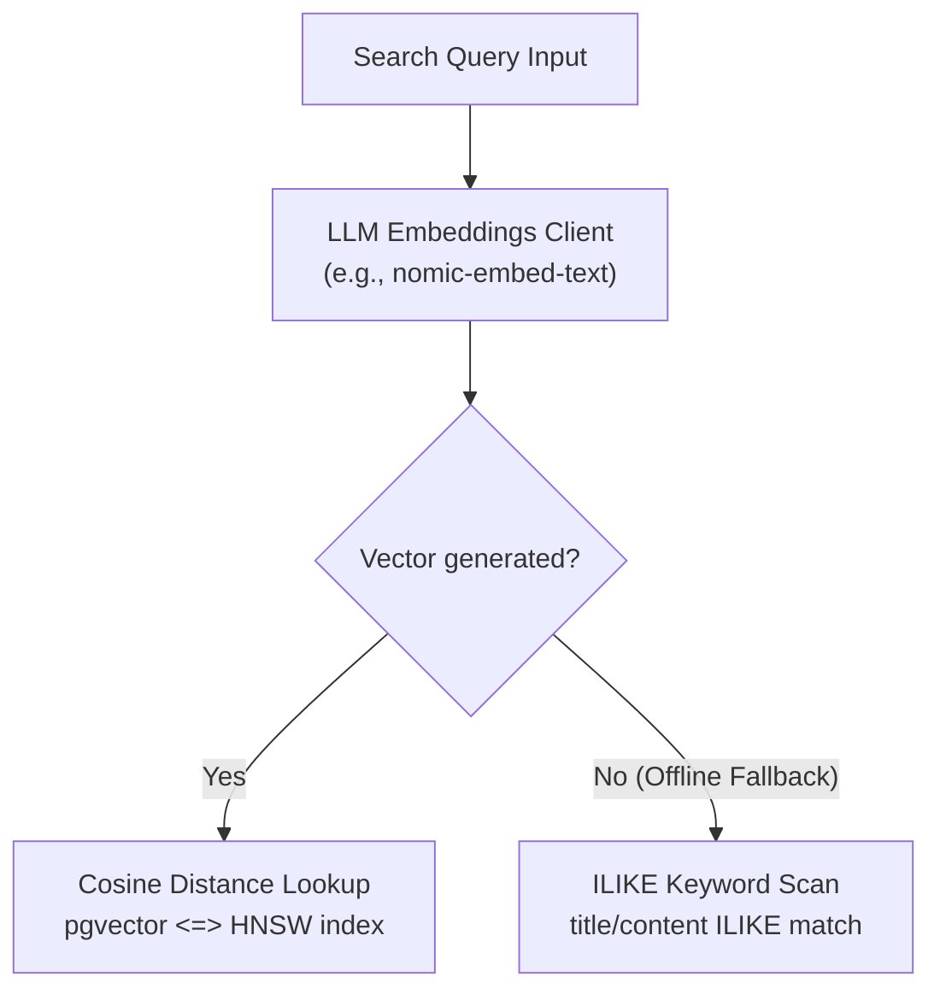

# Technical Design: Hybrid Search & AI Providers

This document specifies the technical design, database indexing, and AI client configurations powering Kollab's semantic and keyword search engine, as well as the Multi-Provider LLM integration.

---

## 1. Vector Database Schema & pgvector Setup

> [!NOTE]
> **Status:** 🟢 Completed

Kollab stores documents as block-based ProseMirror AST structures in a PostgreSQL database. To support Retrieval-Augmented Generation (RAG) and semantic searches, we leverage the `pgvector` extension.



### 1.1 DB Schema DDL
The following migration SQL initializes vector extensions and sets up indexes:

```sql
-- Enable vector extension
CREATE EXTENSION IF NOT EXISTS vector;

-- Document Schema holding 768-dimension vector embeddings
CREATE TABLE IF NOT EXISTS documents (
    id VARCHAR(255) PRIMARY KEY,
    title VARCHAR(255) NOT NULL,
    content TEXT NOT NULL,
    project_id VARCHAR(255) REFERENCES projects(id) ON DELETE CASCADE,
    parent_id VARCHAR(255) REFERENCES documents(id) ON DELETE SET NULL,
    created_at TIMESTAMP NOT NULL,
    updated_at TIMESTAMP NOT NULL,
    embedding vector(768)
);

-- HNSW Cosine Similarity Index
CREATE INDEX IF NOT EXISTS idx_documents_embedding 
ON documents USING hnsw (embedding vector_cosine_ops);
```

### 1.2 Cosine Distance Metric
Kollab uses **Cosine Distance** (`<=>`) for vector similarity, measuring the cosine of the angle between two multi-dimensional documents:
$$Distance(A, B) = 1 - \frac{A \cdot B}{\|A\| \|B\|}$$

A distance of `0.0` represents absolute identity, while `2.0` represents diametric opposition.

---

## 2. Multi-Provider LLM & AI Architecture

> [!NOTE]
> **Status:** 🟢 Completed

To support both cloud-hosted APIs and local model options, Kollab decouples text generation and embedding logic via a unified provider gateway.

### 2.1 LLM Client Interface
The Go backend defines a single interface for all AI interactions:
```go
type LLMClient interface {
    GenerateText(ctx context.Context, prompt string) (string, error)
    GenerateTextEmbeddings(ctx context.Context, text string) ([]float32, error)
}
```

### 2.2 Provider Adapters
Three driver adapters implement this interface under `api/internal/ai/`:
- **`GeminiClient`**: Targets the Google Gemini Developer API. Translates `GenerateText` calls to `gemini-1.5-flash` and `GenerateTextEmbeddings` to native `text-embedding-004` (producing 768 dimensions).
- **`OpenAIClient`**: Targets the OpenAI Chat and Embeddings APIs. Generates text via `gpt-4o-mini` and embeddings via `text-embedding-3-small` (customized to `768` dimensions to match Postgres schemas).
- **`OllamaClient`**: Connects to a local Ollama server for privacy. Generates text via local LLM endpoints (e.g. `llama3`) and embeddings via `nomic-embed-text` (768 dimensions).

### 2.3 Constructor Factory & Credentials Loading
The client factory (`factory.go`) resolves the active client dynamically based on environment variables:
1. If `GEMINI_API_KEY` is loaded, initializes the Google `GeminiClient`.
2. If `OPENAI_API_KEY` is loaded, falls back to the `OpenAIClient`.
3. If neither key is found, defaults to the local `OllamaClient` (configured at `http://localhost:11434`).

A custom environment parser reads variables from `.env` and `.env.local` directly into the system environment on backend startup.

---

## 3. Search Coordination & Offline Fallback Logic

> [!NOTE]
> **Status:** 🟢 Completed

To ensure the application remains functional even if the LLM provider is offline or vector generation fails, Kollab implements a hybrid fallback pipeline.

### 3.1 Flow Control in `postgres/document.go`

When a user triggers a global workspace search:
1. The backend attempts to generate a vector embedding of the search query string.
2. **If vector generation succeeds**: The database performs a vector cosine similarity search.
3. **If vector generation fails (e.g. LLM service unreachable)**: The database performs a standard ILIKE wildcard text matching query across the document title and content.

### 3.2 SQL Queries

#### Case A: Vector Search (HNSW Cosine Similarity)
```sql
SELECT id, title, content, project_id, parent_id, created_at, updated_at
FROM documents
WHERE project_id = $1
ORDER BY embedding <=> $2
LIMIT 10;
```

#### Case B: Keyword Fallback (LIKE Matching)
```sql
SELECT id, title, content, project_id, parent_id, created_at, updated_at
FROM documents
WHERE project_id = $1 
  AND (title ILIKE $2 OR content ILIKE $2)
LIMIT 20;
```

---

## 4. REST API Endpoints

> [!NOTE]
> **Status:** 🟢 Completed

### 4.1 Search API
- **Endpoint**: `/api/search`
- **Method**: `GET`
- **Query Params**:
  - `q`: Search term (e.g., `/api/search?q=developer&project_id=proj_wiki`)
  - `project_id`: Project workspace constraints
- **Response Payload**:
  ```json
  [
    {
      "id": "doc_guides_eng",
      "title": "Developer Style Guides",
      "content": "{\"type\":\"doc\",\"content\":[...]}",
      "projectId": "proj_wiki",
      "parentId": null,
      "createdAt": "2026-06-14T01:00:00Z",
      "updatedAt": "2026-06-14T03:00:00Z"
    }
  ]
  ```

---

## 5. Editor AI Features

> [!NOTE]
> **Status:** ⚪ Planned

The Multi-Provider LLM architecture defined above powers two distinct editor-level features: the transient "Ask AI" inline assistant and the persistent "AI Content Block" macro.

### 5.1 Ask AI (Inline Assistant)
- **Behavior**: A transient, interactive tool triggered by highlighting existing text or hitting `Space` on an empty line.
- **Purpose**: Used for one-time editing operations: summarizing, rewriting, expanding, brainstorming, or fixing the grammar of specific text chunks.
- **Persistence**: Once the user accepts the AI's generated response, the output is injected into the document as standard `text` or `paragraph` nodes. The prompt and the "Ask AI" interface itself disappear entirely and are not saved to the database.

### 5.2 AI Content Block (Persistent Macro)
- **Behavior**: A permanent, draggable block macro (`aiContentBlock` node type) that lives within the document layout.
- **Purpose**: Used for dynamic document generation. The author configures the block with a static prompt (e.g., *"Summarize the meeting notes above"* or *"Write a status update based on the linked Jira macro"*).
- **Persistence**: The macro, including its prompt configuration, is serialized and saved to the database. When the page is loaded (or when a reader clicks the "Refresh" button on the block), the block queries the backend LLM API to dynamically regenerate the text based on the document's current state.
