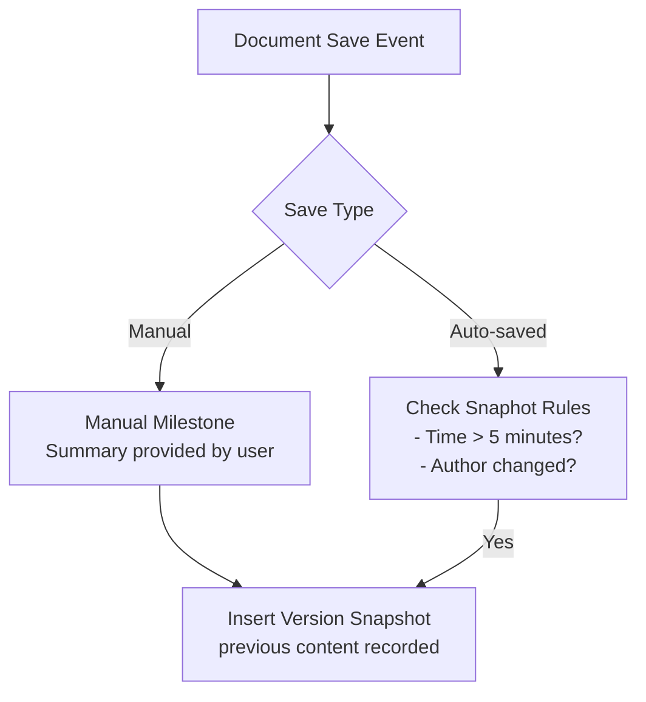
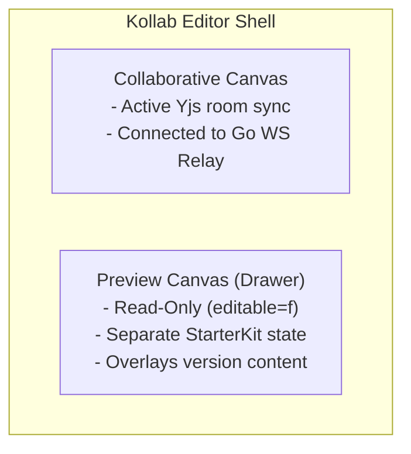

# Technical Design: Data Lifecycle & Version Control

This document specifies the technical design, database schemas, auto-snapshot rules, soft deletes, cascading deletions, and space-level undelete operations in Kollab's data lifecycle system.

---

## 1. Version Database Schema

> [!NOTE]
> **Status:** 🟢 Completed

Document versions are stored in the `document_versions` database table. Each entry references a historical snapshot of the complete document content.



### 1.1 DB Schema DDL
```sql
CREATE TABLE IF NOT EXISTS document_versions (
    id VARCHAR(255) PRIMARY KEY,
    document_id VARCHAR(255) REFERENCES documents(id) ON DELETE CASCADE,
    content TEXT NOT NULL,                  -- Historical ProseMirror JSON state
    version_number INT NOT NULL,            -- Sequential version count
    created_by VARCHAR(255) REFERENCES users(id) ON DELETE SET NULL,
    change_summary VARCHAR(255),            -- "Auto-saved snapshot" or named summary
    created_at TIMESTAMP NOT NULL
);
```

---

## 2. Version Snapshot & Auto-Save Rules

> [!NOTE]
> **Status:** 🟢 Completed

To prevent bloating the database, the Go backend enforces strict rate-limiting and identity guards on auto-saves.

### 2.1 Auto-Snapshot Deciding Logic
When `UpdateDocument` is called during collaborative sync:
1. The backend fetches the latest version snapshot for the document.
2. A snapshot of the **previous** document content is triggered if:
   - **No history**: No previous snapshot exists.
   - **Time elapsed**: More than **5 minutes** have passed since the last snapshot.
   - **Author hand-over**: The user editing the document is different from the contributor of the last snapshot.
3. **In-place Merging & Deduplication**:
   - If the latest version record is an `"Auto-saved snapshot"`, the system updates it in-place instead of creating a new row, unless the conditions in Step 2 trigger a new version row.

### 2.2 Manual Milestone Overrides
Users can explicitly record a milestone checkpoint. This bypasses time and author checks, updating the active snapshot or creating a new version snapshot immediately.

---

## 3. Version Restoration & Safe Snapshots

> [!NOTE]
> **Status:** 🟢 Completed

To prevent data loss, the restore operation performs a double-snapshot transaction.

### 3.1 Restore Lifecycle
1. Client requests a restore event to a target version ID.
2. **Pre-Restore Backup**: The backend saves an emergency snapshot of the document’s current state.
3. **Restoration**: The backend overwrites the document's active `content` column with the target version's content.
4. **Re-Indexing**: The restored content is pushed to a background goroutine to regenerate its AI embedding.

---

## 4. Frontend Uncoupling & Preview Canvas

> [!NOTE]
> **Status:** 🟢 Completed

To allow users to browse historical versions without interrupting active co-authors, Kollab decouples the editor canvases.



- **Collaborative Editor**: Initialized with collaboration extensions connected to the active Yjs sync relay.
- **History Preview Editor**: Initialized as a read-only instance. Clicking a version fetches its raw content and injects it into the preview container.

---

## 5. Soft Delete & Trash Restoration

> [!NOTE]
> **Status:** 🟢 Completed

### 5.1 Schema & Migration
A nullable `deleted_at` timestamp facilitates soft deletion.
```sql
ALTER TABLE documents ADD COLUMN IF NOT EXISTS deleted_at TIMESTAMP WITH TIME ZONE DEFAULT NULL;
CREATE INDEX IF NOT EXISTS idx_documents_deleted_at ON documents(deleted_at) WHERE deleted_at IS NULL;
```

### 5.2 Recursive Soft-Delete Cascades
When a page is deleted, all descendant sub-pages must also be soft-deleted recursively to prevent orphaned nodes.
```sql
WITH RECURSIVE descendants AS (
    SELECT id FROM documents WHERE id = $1
    UNION ALL
    SELECT d.id FROM documents d JOIN descendants desc_ ON d.parent_id = desc_.id
)
UPDATE documents SET deleted_at = NOW() WHERE id IN (SELECT id FROM descendants);
```

### 5.3 Permanent Deletion
Purging documents hard-deletes the page and all sub-pages recursively using `DELETE FROM documents WHERE id IN (SELECT id FROM descendants);`.

### 5.4 Restoration and Orphaning Checks
When restored, `deleted_at` is cleared. If the restored page's parent page (`parentId`) is still soft-deleted, the restored page's `parentId` is updated to `nil`, effectively orphaning it to the root level.

### 5.5 Front-End Trash Page
- Team Trash: `/teams/{teamId}/trash`
- Project Trash: `/teams/{teamId}/p/{projectId}/trash`
- Banner Overlay Warning: Soft-deleted pages display an alert banner and configure the editor as read-only.

### 5.6 Automated Garbage Collection (Configurable Retention)
To prevent unbound database and storage growth, a backend Go cron worker (the "Garbage Collector") runs nightly. 
Administrators can configure the retention policy in Server Settings (e.g., `forever` or `custom` days). If configured to delete after a certain number of days, it queries the database for all documents where `deleted_at < NOW() - INTERVAL 'X days'` and executes the permanent purge routine, destroying the AST, historical versions, and all associated media attachments.

---

## 6. Cross-Space Document Movement

> [!NOTE]
> **Status:** 🟢 Completed

Documents can be seamlessly transferred between entirely different hierarchical spaces (Teams, Projects, or Personal Spaces).

### 6.1 Move Logic
When `MoveDocument` is executed:
1. **Validation**: The system verifies that the document is not being moved inside itself or one of its descendants (preventing cycle loops).
2. **Space Re-Assignment**: The document's `TeamID` and `ProjectID` columns are updated to match the target space (inheriting from the new `ParentID` or directly via root assignments if `ParentID = nil`).
3. **Descendant Propagation**: A recursive hook instantly updates the `TeamID` and `ProjectID` of all nested sub-pages, ensuring the entire tree shifts cleanly to the new destination space.

---

## 7. Automated System Backups

> [!NOTE]
> **Status:** ⚪ Planned

To ensure disaster recovery, Kollab utilizes the same Go cron worker system to manage automated database snapshots.

### 7.1 Backup Routine
1. **Trigger**: A nightly (or weekly) cron job fires.
2. **Snapshot**: The worker executes a `pg_dump` of the entire PostgreSQL database schema and data.
3. **Compression**: The resulting SQL file is compressed (gzip).
4. **Upload**: The compressed payload is uploaded securely to the currently configured storage backend (e.g., S3 or Azure Blob Storage).

### 7.2 Retention Policy
Administrators can define a backup retention policy (e.g., keep the last 7 daily backups and 4 weekly backups). The cron worker will automatically prune old backups from the storage provider after a successful new upload.
