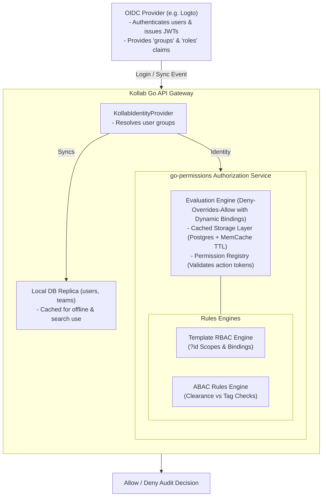

# Design Specification: Permissions & Access Control Model

This document describes the technical architecture and specifications for Kollab's permissions and access control model. The model combines Role-Based Access Control (RBAC) for teams/projects, Attribute-Based Access Control (ABAC) for data classifications, Confluence-style hierarchical inheritance, and OneDrive/SharePoint-style sharing semantics. 

Authorization is driven by the `github.com/wtiger001/go-permissions` library as the core evaluation engine, following the standardized object-scoped role template design pattern.

---

## 1. System Architecture & `go-permissions` Integration

> [!NOTE]
> **Status:** 🟢 Completed

Kollab integrates `go-permissions` at the API Gateway and Service layers to validate all REST and WebSocket operations.



### Core Go Components
1. **`KollabIdentityProvider`**: Resolves user identities and group memberships (reading from the `team_members` table).
2. **`PermissionStore`**: PostgreSQL-backed implementation handling role definition lookups, assignments, and template scope validations.
3. **`ObjectStandardPermissionsAndRoles`**: Utility that registers standard permissions (`read`, `comment`, `write`, `delete`, `grant`, `owner`) and object-scoped roles (`Viewer`, `Commenter`, `Editor`, `Manager`, `Owner`).

---

## 2. Identity, Groups, and Roles Model

> [!NOTE]
> **Status:** 🟢 Completed

### 2.1 Users & Groups (Teams)
- Group memberships are synchronized upon user login based on OIDC/SAML `groups` claims and persisted in `team_members`.
- Standard roles can be assigned directly to a group for a specific object.

### 2.2 Object-Scoped Roles & Template Bindings
Kollab utilizes standard templates to define permissions globally, while assigning permissions to specific objects via binding values (such as `id = "doc-1234"`). The five hierarchical roles define their scope using the placeholder variable `?id`.

### 2.3 Public & Anonymous Access
To support external-facing documentation (like public help centers or open-source guides), authors and administrators can enable Public Access at the Team, Project, or Page level.
- **Anonymous Viewers**: The Go Gateway's authentication middleware allows requests without a valid session token (JWT) to pass through *only* for `GET` routes, provided the target object has `is_public = TRUE`.
- **Read-Only Enforced**: Anonymous users are strictly bound to the `Viewer` role at the engine level. Any state-mutating requests (`POST`, `PUT`, `DELETE`) from unauthenticated sessions immediately return `401 Unauthorized`.
- **Inheritance**: If a Team or Project is marked as public, all underlying documents inherit this public visibility. Authors can override this by explicitly disabling public access at a specific page level.

---

## 3. Relational Database Schema

> [!NOTE]
> **Status:** 🟢 Completed

```sql
-- Security classifications for ABAC
CREATE TYPE classification_level AS ENUM ('public', 'internal', 'confidential', 'pii');

-- Extend documents table
ALTER TABLE documents ADD COLUMN IF NOT EXISTS classification classification_level NOT NULL DEFAULT 'internal';
ALTER TABLE documents ADD COLUMN IF NOT EXISTS inheritance_broken BOOLEAN NOT NULL DEFAULT FALSE;
ALTER TABLE documents ADD COLUMN IF NOT EXISTS is_public BOOLEAN NOT NULL DEFAULT FALSE;

-- Extend teams and projects tables for public visibility
ALTER TABLE teams ADD COLUMN IF NOT EXISTS is_public BOOLEAN NOT NULL DEFAULT FALSE;
ALTER TABLE projects ADD COLUMN IF NOT EXISTS is_public BOOLEAN NOT NULL DEFAULT FALSE;

-- Document sharing links
CREATE TABLE IF NOT EXISTS sharing_links (
    token_hash VARCHAR(64) PRIMARY KEY,
    document_id VARCHAR(255) NOT NULL REFERENCES documents(id) ON DELETE CASCADE,
    role_id VARCHAR(50) NOT NULL,
    scope VARCHAR(50) NOT NULL, -- 'anyone', 'organization'
    password_hash VARCHAR(255) NULL,
    created_by VARCHAR(255) NOT NULL REFERENCES users(id) ON DELETE CASCADE,
    expires_at TIMESTAMP NULL,
    created_at TIMESTAMP NOT NULL DEFAULT NOW()
);

-- User security attributes for ABAC
CREATE TABLE IF NOT EXISTS user_security_attributes (
    user_id VARCHAR(255) NOT NULL REFERENCES users(id) ON DELETE CASCADE,
    attribute_key VARCHAR(100) NOT NULL,
    attribute_value VARCHAR(255) NOT NULL,
    PRIMARY KEY (user_id, attribute_key)
);
```

---

## 4. Hierarchical Inheritance & Evaluation Algorithms

> [!NOTE]
> **Status:** 🟢 Completed

Kollab employs Confluence-style view restriction inheritance. If any ancestor of a document is restricted, a user must have view clearance on that ancestor to view any descendants.

### The Access Check Algorithm
1. **System Override Check**: Check for `builtin.admin`.
2. **ABAC Classification Check**: Extract the classification tag of `D`. Enforce user security attributes.
3. **Ancestry View Validation**: Check if any ancestor `A_i` is restricted, and verify the user has explicit permission on that ancestor.
4. **Action Validation**: Check if `D` has explicit restrictions. If not, check if inheritance is broken. If not, traverse up the tree to inherit the closest explicit role assignments, falling back to Project and then Team.

### Recursive SQL Query for Ancestry Path
```sql
WITH RECURSIVE doc_ancestry AS (
    SELECT id, parent_id, project_id, team_id, classification, inheritance_broken, 1 as depth
    FROM documents WHERE id = :document_id
    UNION ALL
    SELECT d.id, d.parent_id, d.project_id, d.team_id, d.classification, d.inheritance_broken, da.depth + 1
    FROM documents d INNER JOIN doc_ancestry da ON d.id = da.parent_id
    WHERE NOT da.inheritance_broken
)
SELECT * FROM doc_ancestry ORDER BY depth DESC;
```

### Effective Access Report Generation
Computes the flat list of all users with access by resolving ancestry, collecting policy grants (including groups), mapping memberships, and evaluating precedence rules.
