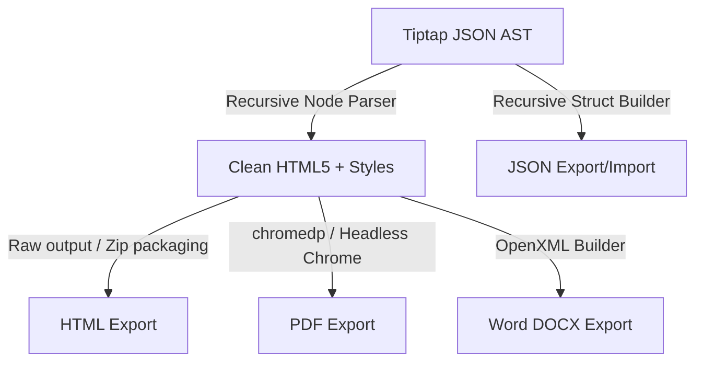
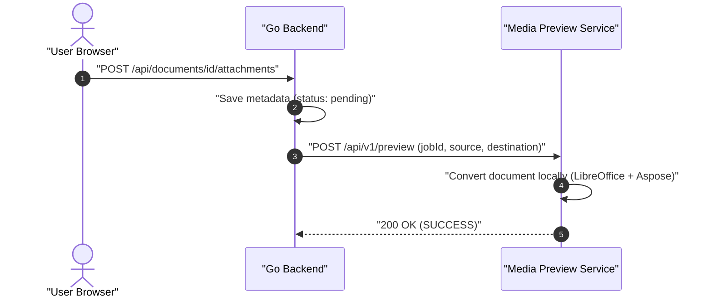

# Technical Design: Import, Export & Media Preview System

This document specifies the technical architecture for exporting/importing page hierarchies (JSON, Word, PDF, HTML) and the isolated Media Preview Service for attachments.

---

## 1. Export & Import Serialization

> [!NOTE]
> **Status:** 🟢 Completed

### 1.1 JSON Import/Export Tree Schema
Designed to be highly portable, omitting space-specific database identifiers.
```json
{
  "title": "Engineering Handbook",
  "content": "{\"type\":\"doc\",\"content\":[...]}",
  "children": []
}
```

### 1.2 Format Output Mapping
- **Word (.docx)**: Converts Tiptap HTML into OpenXML. Hierarchies are combined into a single document with shifted heading levels. Rich macros are rendered as standard Word elements (e.g. shaded tables for callouts).
- **PDF (.pdf)**: Generated via Chrome DevTools `PrintToPDF` from rendered HTML, ensuring visual parity with the editor canvas.
- **HTML (.html)**: Self-contained page or a `.zip` archive for hierarchies, resolving links to relative paths.

### 1.3 Backend Converter Pipeline (Golang)


### 1.4 Markdown Page Import
Users can seamlessly create new pages by uploading a raw `.md` or `.txt` file directly from the Sidebar. 
- **Processing Flow**: The system extracts the first `# Heading` in the file to use as the page's title and removes it from the content payload.
- **Node Type**: The remaining markdown text is injected directly into the new document via the native `markdown-paste` macro block format.
- **Client-Side Execution**: The entire parsing and initialization workflow runs 100% locally in the browser via standard `FileReader` APIs without needing to post the raw file binary to a backend endpoint.

---

## 2. Media Preview Service & Attachments

> [!NOTE]
> **Status:** 🟢 Completed

The architecture decouples file upload from the resource-intensive process of document conversion (Word, PowerPoint, PDF).



### 2.1 Providing Conversion Progress
A dedicated `attachment_previews` table tracks progress asynchronously (`pending`, `converting`, `completed`). The frontend polls or uses WebSockets to show a progress bar. Users can trigger a retry via `POST /api/attachments/{id}/preview/retry`.

### 2.2 Secure Streaming
We do not use public S3/Blob URLs. Instead, the Go backend acts as a secure streaming proxy:
- **Preview Mount Route**: `GET /api/attachments/{id}/preview/view/*filepath`
- **HTML Frame Security**: The React UI loads the preview inside an `<iframe src="/api/attachments/{id}/preview/view/index.html">`. Sub-resource requests naturally carry credentials and are securely routed.

### 2.3 Orphan Deletion
When an attachment is deleted, a cascade hook removes database records, the original file, and recursively deletes the preview folder from storage.

### 2.4 Comprehensive Preview Strategy
| File Category | File Extensions | Recommended Approach |
| :--- | :--- | :--- |
| **Word Docs** | `.docx`, `.doc` | **Aspose** (Server) for high fidelity; LibreOffice fallback. |
| **Spreadsheets** | `.xlsx`, `.xls` | **Aspose** (Server) |
| **Presentations**| `.pptx`, `.ppt` | **Aspose** (Server) |
| **Vector CAD** | `.dwg`, `.dxf` | **Aspose** (Server) to SVG. Browser DXF parser + Three.js as fallback. |
| **3D Models**| `.step`, `.stl`, `.obj`| **Three.js** (Browser) native WebGL. Server-side FreeCAD for STEP to GLTF. |
| **Email Files** | `.msg`, `.eml` | **Browser React libraries** (msgreader) + DOMPurify sanitization. |
| **E-Books** | `.epub` | **epub.js** (Browser) interactive reading. |
| **Video Files** | `.mp4`, `.webm`, `.mov` | **HTML5 Video Player** (Browser). Backend uses an asynchronous FFmpeg queue to transcode heavy/unsupported formats like `.mov` to `.mp4` for web streaming. |
| **Audio Files** | `.mp3`, `.wav`, `.ogg` | **HTML5 Audio Player** (Browser) native playback. |

---

## 3. Object Storage Backend (S3-Compatible)

> [!NOTE]
> **Status:** ⚪ Planned

To ensure high availability and stateless scalability across multiple container instances, Kollab does not store media files or attachments on local disk.

### 3.1 Storage Adapters
All file blobs, converted media previews, and transcoded videos are uploaded directly to an Object Storage Provider. The Go backend implements a generic `StorageProvider` interface with multiple driver adapters:
1. **Amazon S3** (and S3-compatible APIs like MinIO or DigitalOcean Spaces)
2. **Azure Blob Storage**
3. **Local File System** (for air-gapped or single-node testing deployments)

### 3.2 Secure Pre-Signed URLs
Instead of passing file binaries through the Go Gateway (which consumes immense server memory), Kollab uses pre-signed URLs:
- **Uploads**: The React frontend requests a short-lived `PUT` pre-signed URL from the Go API. The client uploads the file directly to the S3 bucket.
- **Downloads/Streaming**: When a user views an attachment, the Go API validates permissions and returns a short-lived `GET` pre-signed URL. The client streams the video or downloads the PDF directly from S3 edge nodes, keeping the Go application incredibly lightweight.

### 3.3 Storage Configuration UI
Administrators can dynamically switch the active storage provider via a dedicated UI page (`/admin/storage`). 
When an admin saves new credentials (e.g., providing an Azure Account Name and Key), the Go backend instantly reinitializes the active `StorageProvider` interface without requiring a server restart.
