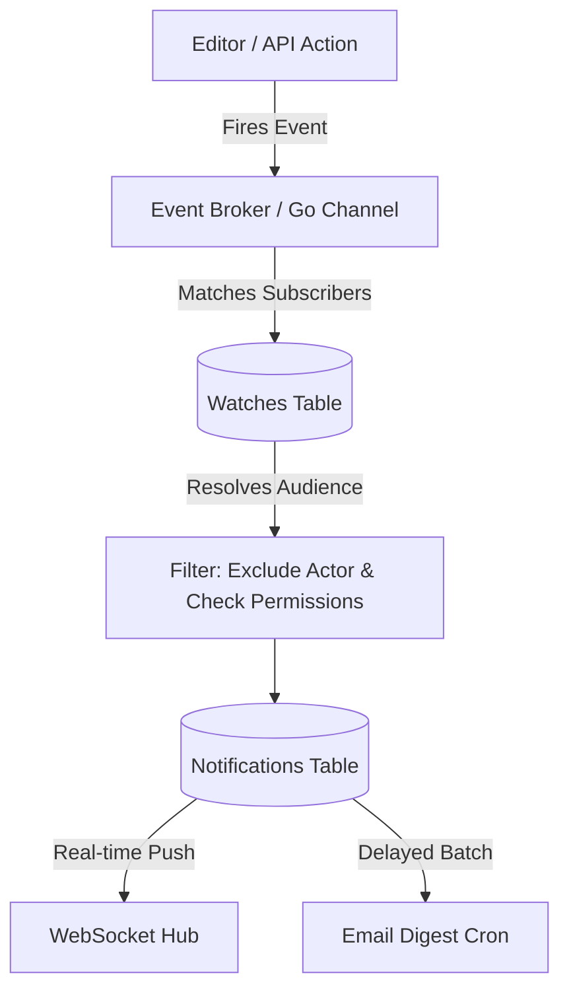

# Technical Design: Watch Capabilities & Notification Engine

This document specifies the architecture for Kollab's Watch system, allowing users to subscribe to changes on documents, projects, or entire team spaces, and detailing how the backend routes these events to in-app notification hubs and email digests.

---

## 1. Subscription (Watch) Data Model

> [!NOTE]
> **Status:** 🟡 Page-level subscriptions are implemented. Project/team inheritance, automatic subscriptions, and notification delivery remain planned.

A user can currently watch a specific Document. Project and Team subscriptions will be added as a compatible extension; until then, subscriptions do not inherit from a parent container.

### 1.1 Database Schema
```sql
CREATE TABLE IF NOT EXISTS document_watches (
    user_id VARCHAR(255) NOT NULL REFERENCES users(id) ON DELETE CASCADE,
    document_id VARCHAR(255) NOT NULL REFERENCES documents(id) ON DELETE CASCADE,
    created_at TIMESTAMPTZ NOT NULL DEFAULT NOW(),
    PRIMARY KEY (user_id, document_id)
);

CREATE INDEX IF NOT EXISTS idx_document_watches_document ON document_watches(document_id);
```

Migration `0005_document_watches.sql` installs the table. `DocumentRepository` exposes idempotent `AddWatch`, `RemoveWatch`, and `IsWatching` methods in both the PostgreSQL and in-memory adapters. The protected routes are `POST`, `DELETE`, and `GET /api/watches/{documentId}/status`; they use the same document read check as favorites.

### 1.2 Frontend UI Integration
- **Watch Toggle Button**: A top-right header action button (an "Eye" icon or "Bell" icon).
- **Current state states**:
  - *Watching*: The user explicitly clicked the Bell icon for this page.
  - *Not Watching*: No page-specific subscription exists.
- **Planned**: inherited states and automatic subscriptions for page creators/commenters.

---

## 2. Event Triggering & Routing

> [!NOTE]
> **Status:** ⚪ Planned. The subscription API intentionally does not claim to deliver notifications until an inbox and event dispatcher exist.

When a mutative action occurs, the backend fires an asynchronous event to an internal Pub/Sub broker or Go channel.

### 2.1 Tracked Events
- **Document Updates**: When a new major version snapshot is saved (debounced to avoid spamming on every keystroke).
- **Comments & Replies**: When a new comment is added or someone replies to an existing thread.
- **Mentions**: When a user is `@mentioned` in a document or a task is assigned to them.
- **State Changes**: When a document is moved, soft-deleted, or restored.

### 2.2 Event Routing Pipeline


1. **Resolution**: The broker queries the `watches` table for the specific `document_id`, its `project_id`, and its `team_id`.
2. **Filtering**: 
   - The user who performed the action (the Actor) is removed from the audience list.
   - The system double-checks `go-permissions` to ensure the watcher still has read access to the document. (If permissions were removed, they shouldn't be notified about a document they can no longer see).

---

## 3. In-App Notification Delivery

> [!NOTE]
> **Status:** ⚪ Planned

Notifications are stored persistently to power an in-app "Notification Inbox" (the bell icon).

### 3.1 Notification Schema
```sql
CREATE TABLE IF NOT EXISTS notifications (
    id UUID PRIMARY KEY DEFAULT uuid_generate_v4(),
    user_id VARCHAR(255) NOT NULL REFERENCES users(id) ON DELETE CASCADE,
    actor_id VARCHAR(255) REFERENCES users(id) ON DELETE SET NULL,
    entity_id VARCHAR(255) NOT NULL,
    event_type VARCHAR(50) NOT NULL, -- 'document_updated', 'comment_added', 'mention'
    content_snippet TEXT,
    is_read BOOLEAN NOT NULL DEFAULT FALSE,
    created_at TIMESTAMP NOT NULL DEFAULT NOW()
);
```

### 3.2 WebSocket Real-Time Push
If the target user is currently connected to the application via WebSocket (the same hub used for Yjs presence), the Go backend immediately pushes a real-time JSON payload. 

```json
{
  "type": "notification",
  "data": {
    "title": "Jane Doe updated Engineering Handbook",
    "snippet": "Added a new section on GraphQL...",
    "link": "/teams/eng/doc-1234"
  }
}
```
The frontend catches this event, increments the unread badge counter on the Bell icon, and optionally displays a temporary toast notification.

---

## 4. Email Digest Delivery

> [!NOTE]
> **Status:** ⚪ Planned

To prevent email fatigue, document update notifications are not sent immediately. They are grouped into batches.

1. **The Digest Worker**: A background Go worker runs every hour (configurable).
2. **Batching**: It queries the `notifications` table for records where `is_read = FALSE` and `email_sent = FALSE`.
3. **Aggregation**: Instead of sending 5 emails for 5 document edits, it sends one email:
   * *"Jane Doe and 2 others made 5 updates to Engineering Handbook"*
4. **Instant Overrides**: High-priority events like direct `@mentions` bypass the batching delay and trigger an email immediately.

---

## 5. Webhook Integrations (Slack & Teams)

> [!NOTE]
> **Status:** ⚪ Planned

To integrate with modern ChatOps workflows, Teams and Projects can configure incoming Webhook URLs (compatible with Slack and Microsoft Teams payload formats).

### 5.1 Event Triggers
When the Event Broker receives a notification event (e.g., a new document is published or a major revision is saved), it queries a `webhooks` table for active integrations mapped to that specific `team_id` or `project_id`.

### 5.2 Delivery Mechanism
A dedicated Go worker marshals the event details into a standard rich-card JSON payload and issues an asynchronous `POST` request to the target webhook URL, immediately alerting the chat channel to the update.
