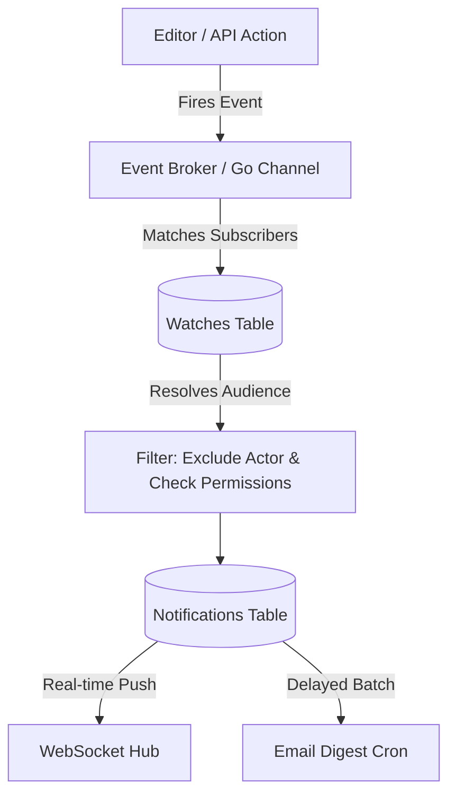

# Technical Design: Watch Capabilities & Notification Engine

This document specifies the architecture for Kollab's Watch system, allowing users to subscribe to changes on documents, projects, or entire team spaces, and detailing how the backend routes these events to in-app notification hubs and email digests.

---

## 1. Subscription (Watch) Data Model

> [!NOTE]
> **Status:** ⚪ Planned

A user can "watch" a specific Document, an entire Project, or an entire Team space. When a parent container (like a Project) is watched, the subscription implicitly cascades to all child documents.

### 1.1 Database Schema
```sql
CREATE TYPE watch_entity_type AS ENUM ('document', 'project', 'team');

CREATE TABLE IF NOT EXISTS watches (
    user_id VARCHAR(255) NOT NULL REFERENCES users(id) ON DELETE CASCADE,
    entity_id VARCHAR(255) NOT NULL,
    entity_type watch_entity_type NOT NULL,
    created_at TIMESTAMP NOT NULL DEFAULT NOW(),
    PRIMARY KEY (user_id, entity_id, entity_type)
);

CREATE INDEX IF NOT EXISTS idx_watches_entity ON watches(entity_id, entity_type);
```

### 1.2 Frontend UI Integration
- **Watch Toggle Button**: A top-right header action button (an "Eye" icon or "Bell" icon).
- **State States**: 
  - *Watching*: The user explicitly clicked watch on this specific page.
  - *Inherited Watch*: The user is watching the parent space. The icon shows as active but indicates it's inherited.
  - *Not Watching*: No subscription.
- **Auto-Watch Rules**: 
  - Users are automatically subscribed to pages they create.
  - Users are automatically subscribed to pages they leave a comment on.

---

## 2. Event Triggering & Routing

> [!NOTE]
> **Status:** ⚪ Planned

When a mutative action occurs, the backend fires an asynchronous event to an internal Pub/Sub broker or Go channel.

### 2.1 Tracked Events
- **Document Updates**: When a new major version snapshot is saved (debounced to avoid spamming on every keystroke).
- **Comments & Replies**: When a new comment is added or someone replies to an existing thread.
- **Mentions**: When a user is `@mentioned` in a document or a task is assigned to them.
- **State Changes**: When a document is moved, soft-deleted, or restored.

### 2.2 Event Routing Pipeline


1. **Resolution**: The broker queries the `watches` table for the specific `document_id`, its `project_id`, and its `team_id`.
2. **Filtering**: 
   - The user who performed the action (the Actor) is removed from the audience list.
   - The system double-checks `go-permissions` to ensure the watcher still has read access to the document. (If permissions were removed, they shouldn't be notified about a document they can no longer see).

---

## 3. In-App Notification Delivery

> [!NOTE]
> **Status:** ⚪ Planned

Notifications are stored persistently to power an in-app "Notification Inbox" (the bell icon).

### 3.1 Notification Schema
```sql
CREATE TABLE IF NOT EXISTS notifications (
    id UUID PRIMARY KEY DEFAULT uuid_generate_v4(),
    user_id VARCHAR(255) NOT NULL REFERENCES users(id) ON DELETE CASCADE,
    actor_id VARCHAR(255) REFERENCES users(id) ON DELETE SET NULL,
    entity_id VARCHAR(255) NOT NULL,
    event_type VARCHAR(50) NOT NULL, -- 'document_updated', 'comment_added', 'mention'
    content_snippet TEXT,
    is_read BOOLEAN NOT NULL DEFAULT FALSE,
    created_at TIMESTAMP NOT NULL DEFAULT NOW()
);
```

### 3.2 WebSocket Real-Time Push
If the target user is currently connected to the application via WebSocket (the same hub used for Yjs presence), the Go backend immediately pushes a real-time JSON payload. 

```json
{
  "type": "notification",
  "data": {
    "title": "Jane Doe updated Engineering Handbook",
    "snippet": "Added a new section on GraphQL...",
    "link": "/teams/eng/doc-1234"
  }
}
```
The frontend catches this event, increments the unread badge counter on the Bell icon, and optionally displays a temporary toast notification.

---

## 4. Email Digest Delivery

> [!NOTE]
> **Status:** ⚪ Planned

To prevent email fatigue, document update notifications are not sent immediately. They are grouped into batches.

1. **The Digest Worker**: A background Go worker runs every hour (configurable).
2. **Batching**: It queries the `notifications` table for records where `is_read = FALSE` and `email_sent = FALSE`.
3. **Aggregation**: Instead of sending 5 emails for 5 document edits, it sends one email:
   * *"Jane Doe and 2 others made 5 updates to Engineering Handbook"*
4. **Instant Overrides**: High-priority events like direct `@mentions` bypass the batching delay and trigger an email immediately.

---

## 5. Webhook Integrations (Slack & Teams)

> [!NOTE]
> **Status:** ⚪ Planned

To integrate with modern ChatOps workflows, Teams and Projects can configure incoming Webhook URLs (compatible with Slack and Microsoft Teams payload formats).

### 5.1 Event Triggers
When the Event Broker receives a notification event (e.g., a new document is published or a major revision is saved), it queries a `webhooks` table for active integrations mapped to that specific `team_id` or `project_id`.

### 5.2 Delivery Mechanism
A dedicated Go worker marshals the event details into a standard rich-card JSON payload and issues an asynchronous `POST` request to the target webhook URL, immediately alerting the chat channel to the update.
