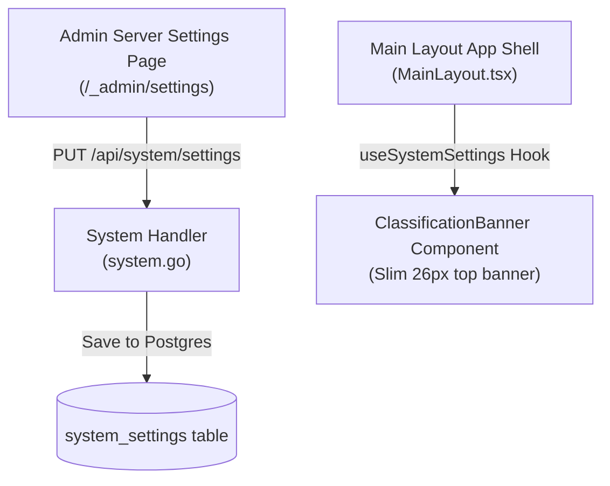

# Technical Design: Server Settings, Branding & Security Classification Banner

This document specifies the technical design, payload schemas, and UI components for global Server Settings, custom branding, and the Security Classification Top Banner in Kollab.

---

> [!NOTE]
> **Status:** 🟢 Implemented

## 1. Data Architecture

All global server settings are stored in PostgreSQL's `system_settings` key-value table. This permits additive settings without a schema migration.

### 1.1 `SystemSettings` model

The backend serializes a strongly typed `SystemSettings` payload. The banner adds `classificationBannerEnabled`, `classificationBannerText`, `classificationBannerBgColor`, and `classificationBannerTextColor` alongside the existing retention, branding, AI, and Aspose settings.

## 2. Authentication Branding Pipeline

`GET /api/auth/config` is intentionally public so the unauthenticated login screen can render its workspace branding. It returns only safe OIDC and branding configuration; licenses, retention settings, and other administrative data remain protected. `main.tsx` hydrates that response before rendering the sign-in experience.

## 3. Server Settings Page

Administrators with `system.admin` use `/_admin/settings`. `GET /api/system/settings` returns the full protected settings payload and `PUT /api/system/settings` persists it atomically before the frontend invalidates its settings query.

## 4. Security Classification Top Banner Architecture

> [!NOTE]
> **Status:** 🟢 Completed

Kollab supports an admin-configurable thin Security Classification Top Banner rendered at the root of the application layout shell (`MainLayout.tsx`).

### 4.1 `SystemSettings` Data Schema Extensions
- `classificationBannerEnabled`: (`boolean`) Controls whether the security banner is visible.
- `classificationBannerText`: (`string`) Text string displayed in the banner (e.g. `UNCLASSIFIED`, `COMPANY PROPRIETARY`, `CONFIDENTIAL`, `RESTRICTED / SECRET`).
- `classificationBannerBgColor`: (`string`) injected theme variable for the banner background (for example, `var(--primary-color)`).
- `classificationBannerTextColor`: (`string`) injected theme variable for the banner text (for example, `var(--bg-color)`).

### 4.2 Preset Quick-Select Configurations
- 🟢 **UNCLASSIFIED**: `var(--primary-color)`, text `var(--bg-color)`
- 🟡 **PROPRIETARY**: `var(--accent-color)`, text `var(--bg-color)`
- 🟠 **CONFIDENTIAL**: `var(--secondary-color)`, text `var(--bg-color)`
- 🔴 **RESTRICTED / SECRET**: `var(--text-primary)`, text `var(--bg-color)`

Persisted literal colors from older settings are deliberately ignored and fall back to the active theme. This keeps banner contrast and visual language aligned with every supported theme preset.
