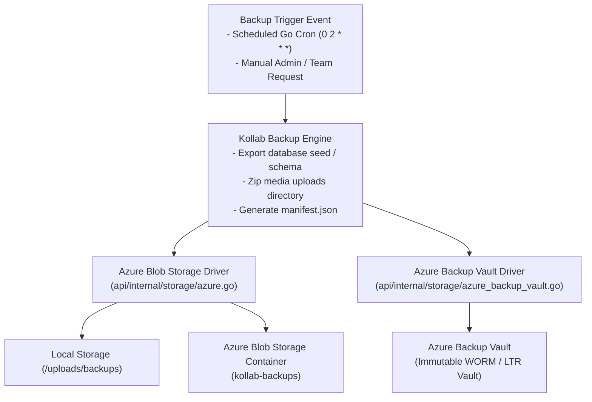

# Technical Design: Enterprise System & Scoped Backups with Azure Blob Storage & Azure Backup Vault Integration

This document specifies the technical design, storage drivers, vault API integrations, archive schemas, and automated backup scheduling algorithms for Kollab's system-level and scoped (Team/Project) disaster recovery engine.

---

## 1. Architecture Overview

> [!NOTE]
> **Status:** 🔴 Prototype — not production-ready

The following is target architecture only. The current worktree uses in-memory Blob storage, mock Vault recovery points, and mock SAS URLs; it does not call Azure and must not be configured for real backups.

---

## 2. Azure Backup Vault API Integration

The `AzureBackupVaultClient` driver (`api/internal/storage/azure_backup_vault.go`) wraps the Azure Resource Manager API (`armdataprotection` / `armbackupservices`) to perform native Vault-level operations directly from Kollab.

### 2.1 Supported Vault Operations
- `TriggerVaultBackup(ctx)`: Initiates an on-demand snapshot inside the Azure Backup Vault.
- `ListRecoveryPoints(ctx)`: Queries immutable Recovery Points stored inside the Azure Backup Vault.
- `TriggerVaultRestore(ctx, recoveryPointID)`: Triggers a Vault-level restore job.

### 2.2 Configuration Attributes
- `subscriptionID`: Azure Subscription ID.
- `resourceGroup`: Azure Resource Group containing the Backup Vault.
- `vaultName`: Name of the Azure Backup Vault / Recovery Services Vault.
- `backupInstanceName`: Target Backup Instance name.

---

## 3. Retention & Pruning (30 Daily + 12 Monthly)

- **Daily Retention**: Retains snapshots taken in the last 30 days.
- **Monthly Retention**: Snapshots taken on the 1st of each month are retained as Long-Term Retention (LTR) milestones for up to 12 months (365 days).

## Implemented local transfers

Portable local team/project export and import are implemented separately from this Azure prototype. See [Portable team and project transfers](scoped_transfers.md). The admin cloud preview explicitly reports that its controls do not create backups or restore data.
