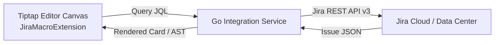

# Technical Design: Jira & Confluence Live Integrations

This document specifies the technical design, Tiptap macro extensions, OAuth 2.0 connectors, and issue-to-page conversion pipelines for Jira and Confluence integrations.

---

## Status

> [!NOTE]
> **Status:** 🔴 Prototype — not production-ready

The following is target architecture only. The current worktree returns sample Jira issues and a placeholder Confluence iframe; it does not have authenticated Jira or Confluence transport.

## 1. Jira Live JQL & Issue Conversion

### 1.1 Live Jira JQL Macro
The `JiraMacroExtension` in Tiptap parses custom nodes (`
`), fetching live issue statuses, assignees, priorities, and sprint fields in real-time.

### 1.2 Jira Issue to Kollab Wiki Page Conversion
Users can convert a Jira issue into a permanent Kollab documentation page via `ConvertIssueToKollabPage`. The converter transforms Jira description HTML, issue key, priority, assignee, comments, and file attachments into a structured Tiptap AST document.

---

## 2. Confluence Live Page Embeds

Kollab embeds live Confluence pages via an interactive iframe container (`ConfluencePageEmbed`), fetching page metadata and injecting secure auth tokens to maintain cross-system visibility.
