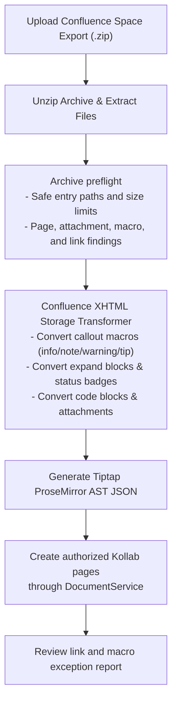

# Technical Design: Confluence Space Backup Importer & Migration Engine

This document details the technical design, XML parsing algorithms, XHTML storage format AST transformers, attachment migration pipelines, and AI vector re-indexing for Confluence space imports.

---

## 1. Architecture Overview

> [!NOTE]
> **Status:** 🟡 Page migration, archive preflight, HTML directory-index hierarchy recovery, archive-scoped idempotency, and referenced attachment transfer are implemented. `entities.xml` hierarchy parsing remains planned work.

The Confluence Migration Engine (`api/internal/migration/confluence.go`) enables automated migration from **Confluence Cloud** and **Confluence Data Center / Server** into Kollab.



---

## 2. Confluence XHTML Macro Mapping Matrix

| Confluence Macro Tag | Kollab Block Node | Output HTML Class / AST Element |
| :--- | :--- | :--- |
| `<ac:structured-macro ac:name="info">` | Callout Info Panel | `<blockquote class="kollab-callout-info">` |
| `<ac:structured-macro ac:name="note">` | Callout Note Panel | `<blockquote class="kollab-callout-note">` |
| `<ac:structured-macro ac:name="warning">` | Callout Warning Panel | `<blockquote class="kollab-callout-warning">` |
| `<ac:structured-macro ac:name="tip">` | Callout Tip Panel | `<blockquote class="kollab-callout-tip">` |
| `<ac:structured-macro ac:name="expand">` | Expandable Details | `<details class="kollab-expand">` |
| `<ac:structured-macro ac:name="status">` | Status Badge Widget | `<span class="kollab-status-badge">` |
| `<ac:structured-macro ac:name="code">` | Code Block Node | `<pre><code>` |

---

## 3. Archive preflight and migration summary

`POST /api/migration/confluence/preview` accepts the archive as multipart field `backup` and returns facts from that archive. It rejects unsafe entries, caps the archive at 10,000 entries and source pages at 10 MiB, detects supported and unsupported macros, and reports missing local HTML links. It does not create documents.

Imports calculate a SHA-256 digest of the uploaded archive and write one record per source path to `confluence_import_records` (migration `0007`). The record is scoped to the requested team/project target and target document ID. Retrying the identical archive in the same target safely returns the earlier page as skipped; it does not create another page based on the same source path.

For each page, preflight retains unique `<ri:attachment ri:filename="…">` references. Import matches those filenames to safe archive entries and sends their bytes through `AttachmentService`, preserving the page association and normal storage/preview behavior. An unmatched reference or an oversized/unreadable attachment is a per-page warning, not a hidden partial success.

`POST /api/migration/confluence/import` runs the same preflight and only creates pages if it has no error-level findings. The handler calls `DocumentService.CreateDocument`, preserving normal membership checks, owner grants, versioning, and audit events. A page that cannot be created is listed in `warnings`; the response does not report it as a success.

For HTML exports, `directory/index.html`, `directory/index.htm`, or `directory/index.xhtml` is treated as the parent of pages in the same directory and of nested directory index pages. Parent documents are created first and their Kollab IDs are passed to child creation. The importer emits no fabricated hierarchy when an archive lacks those index pages.

Attachment files are deliberately reported but not copied. Returning their real count allows the UI and operator to see the remaining work without a misleading “imported” claim.

Upon completion, the engine returns a detailed `MigrationSummary` JSON response:
```json
{
  "spaceKey": "CONF",
  "totalPages": 18,
  "totalAttachments": 12,
  "successCount": 17,
  "skippedCount": 1,
  "warnings": ["guides/legacy.xhtml was not created: unauthorized"],
  "issues": [{"level": "warning", "code": "unsupported-macro", "message": "The \"gliffy\" macro appears 2 time(s) and will be preserved as readable source text."}]
}
```

---

## 4. Migration Wizard UI

Space owners and system administrators access the migration engine via the `/import/confluence` full page wizard.
