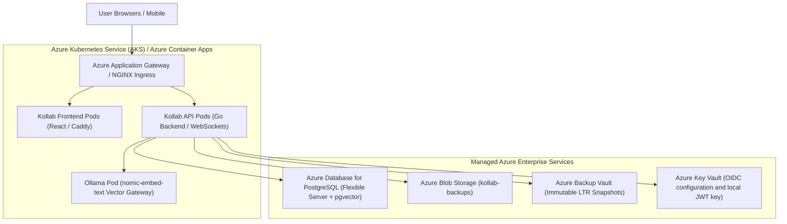
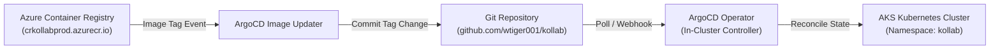

# 22. Kubernetes & Azure Cloud Deployment Architecture

This document specifies the technical design, container manifests, Azure native deployment topologies, GitOps pipelines using ArgoCD, ingress configurations, and infrastructure security models for deploying Kollab at enterprise scale.

---

## 1. System Deployment Topology

> [!NOTE]
> **Status:** 🟡 Reference architecture — deployment manifests are not included

This document is a future deployment reference, not an operational runbook. The referenced `k8s/` manifests, Azure infrastructure, and GitOps configuration are not present in this repository.

Kollab is intended to consist of three primary containerized tiers:
1. **Frontend App Shell**: React SPA served via Caddy / NGINX reverse proxy.
2. **Backend API Gateway**: Go REST/WebSocket server using `chi` router and Gorilla pumps.
3. **Database & AI Vector Search**: PostgreSQL 16 with `pgvector` extension + Ollama embedding Gateway (`nomic-embed-text`).



---

## 2. Native Azure Deployment Strategies

### Option A: Azure Container Apps (ACA) - *Recommended for Microservices*
- **Architecture**: Serverless microservices platform powered by Kubernetes & Envoy.
- **Scaling**: Auto-scale API pods from 0 to N based on HTTP traffic or CPU usage using KEDA.
- **TLS & Routing**: Ingress with automatic managed TLS certificates.

### Option B: Azure App Service (Web App for Containers) - *Recommended for Simple Ops*
- **Architecture**: Multi-container Docker Compose deployed to App Service.
- **Service Plan**: Linux P1v3 / P2v3.
- **Features**: Built-in deployment slots, continuous deployment via GitHub Actions, and OIDC-aware reverse-proxy deployment options.

### Option C: Azure Kubernetes Service (AKS) with GitOps & ArgoCD - *Recommended for Maximum Scale*
- **Architecture**: Full managed Kubernetes cluster with ArgoCD GitOps operator.
- **Identity**: Azure Workload Identity (OIDC federation) for keyless access to Azure Storage & Backup Vault.

---

## 3. GitOps Architecture with ArgoCD



### 3.1 ArgoCD Application Manifest (`argocd-application.yaml`)

```yaml
apiVersion: argoproj.io/v1alpha1
kind: Application
metadata:
  name: kollab-production
  namespace: argocd
  finalizers:
    - resources-finalizer.argocd.argoproj.io
spec:
  project: default
  source:
    repoURL: 'https://github.com/wtiger001/kollab.git'
    targetRevision: HEAD
    path: k8s/overlays/production
  destination:
    server: 'https://kubernetes.default.svc'
    namespace: kollab
  syncPolicy:
    automated:
      prune: true
      selfHeal: true
    syncOptions:
      - CreateNamespace=true
      - ApplyOutOfSyncOnly=true
```

### 3.2 Kustomize Directory Hierarchy

```
k8s/
├── base/
│   ├── kustomization.yaml
│   ├── api-deployment.yaml
│   ├── web-deployment.yaml
│   ├── service.yaml
│   └── ingress.yaml
└── overlays/
    ├── staging/
    │   ├── kustomization.yaml
    │   └── replica-patch.yaml
    └── production/
        ├── kustomization.yaml
        ├── replica-patch.yaml
        └── external-secrets.yaml
```

---

## 4. Kubernetes Base Manifests

### 4.1 Go API Deployment (`kollab-api-deployment.yaml`)
```yaml
apiVersion: apps/v1
kind: Deployment
metadata:
  name: kollab-api
  namespace: kollab
spec:
  replicas: 3
  selector:
    matchLabels:
      app: kollab-api
  template:
    metadata:
      labels:
        app: kollab-api
    spec:
      containers:
      - name: kollab-api
        image: crkollabprod.azurecr.io/kollab-api:latest
        ports:
        - containerPort: 8080
        env:
        - name: DATABASE_URL
          valueFrom:
            secretKeyRef:
              name: kollab-db-secret
              key: connection-string
        - name: JWT_SECRET
          valueFrom:
            secretKeyRef:
              name: kollab-auth-secret
              key: jwt-secret
        resources:
          requests:
            cpu: "250m"
            memory: "512Mi"
          limits:
            cpu: "1000m"
            memory: "2Gi"
        readinessProbe:
          httpGet:
            path: /health
            port: 8080
          initialDelaySeconds: 5
          periodSeconds: 10
```

---

## 5. Security & Key Vault Integration

- **Secrets Management**: Secrets are synchronized from **Azure Key Vault** using **External Secrets Operator (ESO)** into Kubernetes Secrets.
- **Identity Federation**: Azure Workload Identity maps K8s Service Accounts directly to Azure Managed Identities, eliminating stored passwords.
