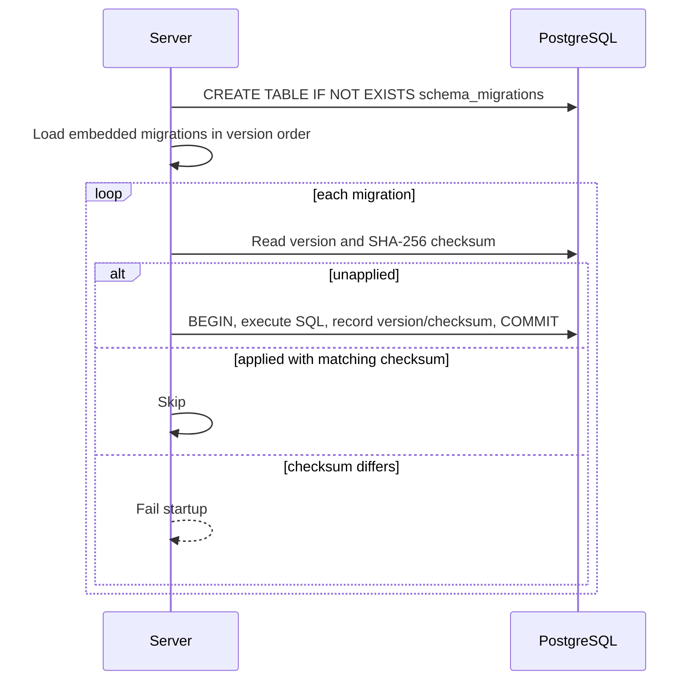

# Database Migration Architecture

## Purpose

Kollab uses an application-managed, append-only migration ledger to make PostgreSQL schema evolution deterministic. It replaces replaying the cumulative bootstrap schema on every server start.

## Model

`0001` is the existing cumulative schema baseline. Subsequent migrations are embedded from `api/internal/postgres/migrations/` and are ordered by their numeric filename prefix, for example `0002_schema_migration_index.sql`.

## Invariants

- A migration version is applied at most once.
- A deployed migration is immutable: the recorded SHA-256 must match the embedded SQL.
- Each migration and ledger record commit in one database transaction.
- Migration failure prevents server startup; the service must not operate against an unknown schema.

## Adding a migration

Create a new, lexically ordered SQL file under `api/internal/postgres/migrations/`. Use forward-only SQL and test it against a fresh PostgreSQL instance and an upgraded existing instance. Never modify the baseline or an applied migration; add a corrective migration instead.
