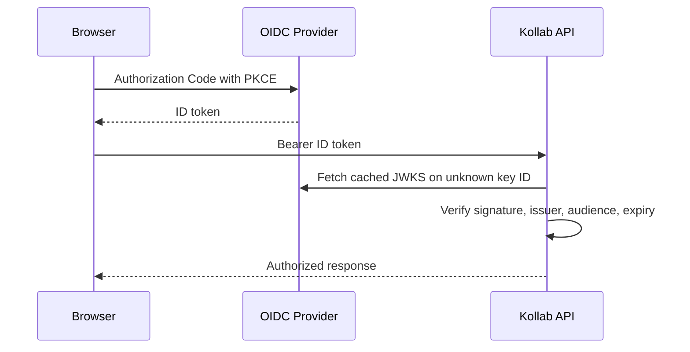

# OIDC Authentication Architecture

Kollab is an OIDC relying party. At startup it obtains the provider's discovery document from `OIDC_AUTHORITY/.well-known/openid-configuration`, requires the returned issuer to exactly match the configured issuer, and uses the advertised HTTPS JWKS URI for signature verification.

In OIDC mode, HMAC-signed local tokens, registration, and password-login endpoints are disabled. The separate `AUTH_MODE=local` path is intentionally explicit and requires a JWT secret of at least 32 bytes; it is for isolated development only.

`BOOTSTRAP_ADMIN_USER_ID` is an optional deployment-time bootstrap. When set, the corresponding immutable OIDC `sub` receives `builtin.admin`; deployments should remove it after establishing normal administrators.

SAML is deliberately not exposed by the API. An identity broker should translate a corporate SAML federation into the OIDC contract above until a complete SAML SP implementation is introduced.
