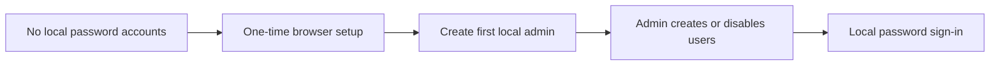

# Local Identity Architecture

`AUTH_MODE=local` is the default when `AUTH_MODE` is unset. OIDC remains an explicit alternative, so a missing provider configuration cannot silently redirect sign-in.

Passwords are validated for 12-character length plus upper, lower, and numeric characters, then stored with bcrypt. Public registration is disabled. `users.is_active` is enforced at login and allows administrators to suspend an account without deleting its ownership history. JWTs are held in browser memory only; refreshing a local session requires another sign-in.

The public `POST /api/auth/setup` handler is mounted only in local mode and advertises itself to the frontend only while the installation has no users. Creation uses a PostgreSQL transaction-scoped advisory lock and an existence check, making first-admin creation a single-winner operation even under concurrent browser requests. The winning account receives `builtin.admin`; the endpoint returns a signed local token and permanently closes the setup flow for the process.

## Administrative interface and API

`/_admin/users` is rendered only when the public configuration reports `authMode: "local"`. The API remains the authorization boundary: every endpoint requires an authenticated user with `system.admin`.

| Method | Endpoint | Action |
| --- | --- | --- |
| `GET` | `/api/admin/users` | List local accounts without password hashes. |
| `POST` | `/api/admin/users` | Create an active local account. |
| `PUT` | `/api/admin/users/{id}/active` | Enable or suspend an account. |
| `PUT` | `/api/admin/users/{id}/password` | Replace a password after policy validation. |

The login handler limits an in-process `(normalized username, remote address)` pair to five failed attempts before returning `429` for 15 minutes. Successful authentication clears that counter. Deployments with multiple API replicas must additionally apply a shared rate limit at the reverse proxy or identity gateway, because this lightweight protection is intentionally process-local.

## Attachment authorization

Attachment file, preview, preview-status, retry, and preview-asset endpoints execute behind the standard authentication middleware and resolve the attachment's `document_id` before responding. The access evaluator then applies `read`, `write`, or `delete` against that parent document. Browser elements that cannot set an `Authorization` header may provide `authToken` only on `/api/attachments/` routes; the token is still fully validated before the document authorization check.

WebSocket upgrades validate the token and `read` access to the requested `docId` before the socket is accepted. Cross-origin upgrades are rejected unless the request origin matches the serving host.
