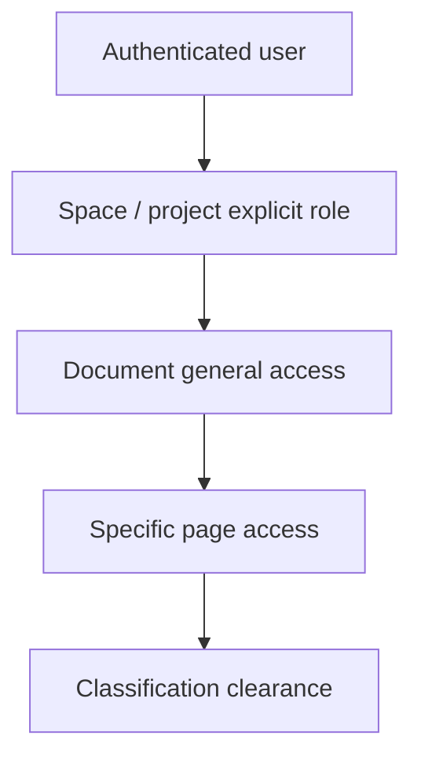

# Confluence-Style Permissions

Kollab uses Team as the user-facing **Space** security boundary. A team membership is an identity relationship only; it never grants content access by itself. Access is granted through explicit Team (space), Project, or document role assignments.

## Roles

- **Viewer**: read.
- **Commenter**: read and comment.
- **Editor**: read, comment, and edit.
- **Manager** and **Owner** are container-administration roles. They are assigned through audited administration flows, never page-specific access requests.

## Page restrictions

An unrestricted page derives baseline visibility from its space/project role. A restricted page requires a specific page grant. View restrictions on a parent must be satisfied to view a child. Parent edit restrictions do not prevent editing a child when the user has child or space edit authority, matching Confluence's view-inheritance semantics.

The page access endpoint accepts only viewer, commenter, and editor grants. This prevents a person with page-restriction authority from escalating another principal to manager or owner.
