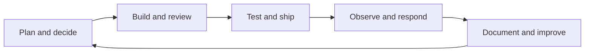
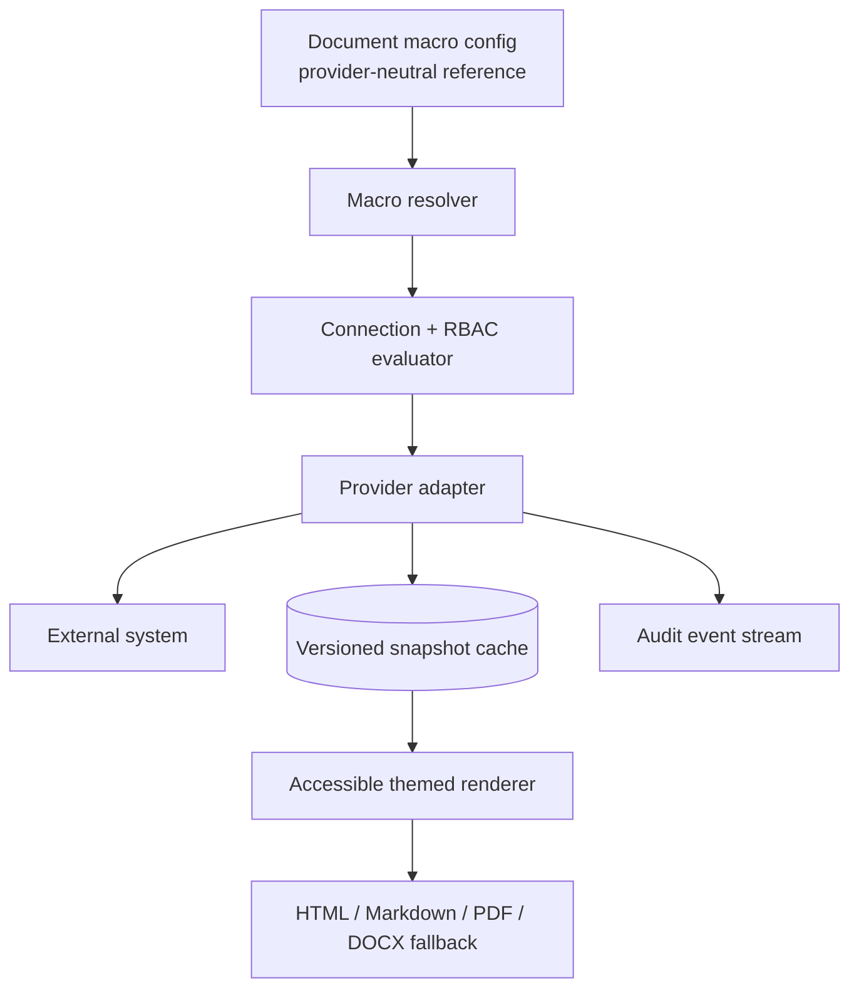

# Macro Roadmap: Enterprise Knowledge and Engineering Workflows

> **Status:** 🟡 Living proposal — no item below is an implementation commitment.
>
> **Purpose:** A maintained, prioritised catalog of macros Kollab could offer as a modern, portable, enterprise-ready replacement for Atlassian Confluence—especially for engineering organizations. It deliberately complements (rather than replaces) the implemented and planned node definitions in [03_macros_and_plugins.md](03_macros_and_plugins.md).

## 1. Product Thesis

Kollab macros should turn a page from static prose into a trustworthy, readable surface for the systems engineers already use. A Confluence replacement must first be a great collaborative wiki: pages and hierarchy, templates, reusable knowledge, structured information, discoverability, comments, lifecycle governance, exports, and migration are core product capabilities—not optional integrations. The most valuable macros have a clear source of truth, make context understandable without leaving the page, respect the viewer's permissions, and degrade gracefully to a dated snapshot when a remote system is unavailable.

The roadmap favours an engineering team's core loop:



### 1.1 Competitive position: parity without a clone

Confluence now combines collaborative pages with whiteboards, databases, Smart Links, templates, content lifecycle tooling, analytics, automation, and deep Jira connections. [Atlassian's feature overview](https://www.atlassian.com/software/confluence/features) is the useful parity baseline; its [content-properties report](https://support.atlassian.com/confluence-cloud/docs/insert-the-page-properties-report-macro/) and [Smart Links](https://support.atlassian.com/confluence-cloud/docs/insert-links-and-anchors/) show two especially important patterns: structured knowledge can roll up across pages, and a pasted URL can become useful context.

Kollab should **match the jobs**, rather than replicate a large catalog of provider-specific legacy macros or require every team to learn a proprietary query language. Its product posture should be:

| Confluence-strength to meet | Kollab's reimagined improvement |
| --- | --- |
| Collaborative pages, spaces, hierarchy, templates, comments, versions, and publishing | A single document model with real-time collaboration, explicit draft/review/published lifecycle, portable exports, and stable IDs that survive title or location changes. |
| Macros and Smart Links | A small set of consistent primitives—**smart object**, **collection view**, **embedded source**, **reusable content**, and **action**—with predictable configuration, source/freshness labels, and text-first fallbacks. |
| Content properties and reports | Typed, schema-governed document properties and saved collection views; no fragile, visually-hidden table as the data model. |
| Databases and multiple views | A first-class collection model that can present the same items as table, board, list, cards, calendar, timeline, or relationship graph, while preserving page context. |
| Whiteboards and visual collaboration | A page-embedded visual canvas with an explicit conversion path from idea → ADR, task, or structured collection item; do not ship an isolated drawing surface. |
| Jira-connected planning | Provider-neutral work-item, delivery, and incident objects, with excellent Jira support but no assumption that every customer is an Atlassian customer. |
| Marketplace extensibility | A governed, signed macro/connector SDK with permission declarations, theme inheritance, export fallbacks, and an administrator approval path. |
| Cloud administration and enterprise controls | Deployment-flexible ownership, SSO/SCIM, auditability, classification, retention, and data-residency choices; integrations must work in self-hosted and private-network deployments. |

**Deliberate differentiation:** Kollab should be developer-native and evidence-first: code and contracts can be cited by immutable revision; live data visibly declares its freshness; operational pages can carry runbooks, SLOs, incidents, and deployments; and every essential macro has a useful exported/offline representation. AI may accelerate discovery or drafting, but must always preserve source citations, user control, and workspace permissions.

### 1.2 Macro families

| Family | Role | Persistence model |
| --- | --- | --- |
| **Formatting** | Makes authored knowledge clearer and more scannable. | Native ProseMirror/Yjs node or mark. |
| **Structured knowledge** | Captures information in a queryable, consistent shape. | Node plus indexed document metadata where needed. |
| **Live reference** | Shows a permission-checked view of an external source of truth. | Stable reference + cached snapshot + freshness metadata. |
| **Action / workflow** | Starts or records a controlled workflow without silently changing another system. | Explicit user action, audit event, idempotency key. |
| **Typed-data viewer** | Renders a well-known data format safely and accessibly. | Attachment or remote reference + renderer configuration. |

### 1.3 Non-negotiable macro contract

Every new macro should satisfy the following before it moves out of discovery:

1. **Portable content:** persist a provider-neutral reference and a readable fallback/snapshot; exports must retain meaningful text, links, and alt text.
2. **Permission-safe data:** evaluate Kollab access before data is returned; use least-privilege, scoped connection credentials; never serialize tokens or secret values into Yjs, HTML, exports, logs, or browser storage.
3. **Freshness people can see:** render source, last successful refresh, expiration, and stale/error state. Readers must be able to distinguish a snapshot from live data.
4. **Predictable collaboration:** configuration changes are collaborative document edits; destructive external actions require confirmation, idempotency, and an auditable actor/time/result.
5. **Theme, accessibility, and responsive design:** use Kollab CSS variables exclusively, work in light/dark presets, support keyboard navigation and screen-reader labels, and provide a narrow-width layout.
6. **Secure embeds:** default to a curated provider allowlist and sandboxed iframes. Remote URLs require SSRF defenses, redirect limits, content-type/size limits, and an explicit trust boundary.
7. **Performance budget:** no unbounded fan-out on document load. Batch identical requests, cache snapshots per connection/configuration, honor rate limits, and offer manual refresh only where justified.
8. **Ownership and lifecycle:** name a macro owner, connection scope, retention policy, export representation, and a deprecation/migration path before release.

## 2. What Is Already Covered

This roadmap does not reopen existing work. Current specifications already cover native callouts, status, task lists, dates, details, cards/tabs, navigation, smart links, Draw.io, image galleries, Markdown import, GitLab and Jira views, code blocks, smart tables, data tables/charts/CSV, maps, page properties/rollups, media, and several legacy-wiki parity candidates. See [03_macros_and_plugins.md](03_macros_and_plugins.md), [11_enterprise_publishing_and_templates.md](11_enterprise_publishing_and_templates.md), and [20_jira_confluence_integrations.md](20_jira_confluence_integrations.md).

The candidates below focus on gaps, refinements, and high-leverage composition around those foundations.

## 3. Recommended Delivery Sequence

The priority labels describe suggested investment order, not release dates.

| Priority | Outcome | Recommended macro set | Why it comes now |
| --- | --- | --- | --- |
| **P0 — Confluence-replacement core** | A team can migrate and run its knowledge base without losing essential wiki, reporting, reuse, or navigation workflows. | Typed properties and collection views; reusable excerpts/includes; smart objects; robust content tree/search; templates; drafts/review/publish; migration compatibility; accessible diagrams and attachments. | A knowledge system without these becomes a collection of attractive isolated pages, not a Confluence replacement. |
| **P0.5 — Developer-native differentiation** | Engineering pages connect decisions to immutable code, contracts, services, tasks, and operational evidence. | ADR, runbook, API contract, structured data, code line reference, configuration matrix, service/dependency card, task rollup, GitHub/GitLab/Azure DevOps work objects. | This is Kollab's clearest reason to choose it over a general-purpose wiki, while reusing P0 primitives. |
| **P1 — Delivery and operations** | Delivery health, incidents, tests, releases, and observability are visible where plans and runbooks live. | CI/test/coverage, release, feature flag, incident, on-call, status page, dashboard/metric, log/trace, deployment, calendar. | High operational value after reliable collection, connection, caching, and permission primitives exist. |
| **P2 — Selected enterprise systems of record** | Kollab becomes the readable junction for the systems each customer actually uses. | Slack/Teams, Linear, ServiceNow, CRM, BI, directory, procurement/risk, e-sign acknowledgement. | Add based on deployment evidence, not by attempting to out-integrate a marketplace. |
| **P3 — Specialist and ecosystem workflows** | Specialist teams can add disciplined extensions without compromising core knowledge management. | Notebook, geospatial, CAD, scientific, digital twin, low-code automation, custom connector SDK. | Broad reach, but should follow a mature plugin governance model and demonstrated demand. |

### 3.1 The P0 product gates

Before adding a new vendor connector, verify that Kollab can answer **yes** to all of these questions:

1. Can a new team create, organize, find, reuse, comment on, review, publish, export, and archive knowledge without a connector?
2. Can a Confluence migration preserve hierarchy, anchors, attachments, common macros, version context, labels/properties, and working internal links with a readable exception report?
3. Can authors create a typed record once and show it in multiple filtered views without maintaining duplicate page tables?
4. Can a reader tell whether an object is authored here, a current external view, or an older snapshot—and navigate to its source?
5. Can an administrator safely approve, scope, audit, rotate, and remove a connector or plugin without breaking unrelated documents?

## 4. P0 / P0.5: Structured Knowledge and Developer Differentiation

### 4.1 Structured authoring and reusable knowledge

| Candidate macro | User value | Essential behavior / data |
| --- | --- | --- |
| **Decision record (ADR)** | Captures a durable decision, alternatives, consequences, owner, and review date. | Template-backed node with lifecycle (`proposed`, `accepted`, `superseded`, `deprecated`), immutable decision ID, links to superseding ADRs, and a rollup view. |
| **Runbook / procedure** | Makes production procedures executable and safely repeatable. | Ordered, checkable steps; prerequisites; rollback; owner; expected duration; hazard/approval gates; optional evidence links. Do not execute shell commands by default. |
| **Reusable excerpt / content block** | Maintains a policy, API disclaimer, or support instruction in one place. | Stable source document/node ID, version/publish state, explicit include mode (live vs pinned revision), cycle detection, and export expansion. |
| **Glossary / definition** | Gives domain terms a canonical meaning without cluttering every page. | Inline term mark resolving to a governed glossary record; hover preview, source link, owner, aliases, and deprecated-term redirect. |
| **FAQ / troubleshooting decision tree** | Turns support knowledge into an answerable, scannable path. | Question/answer items with vote/helpfulness signal, `appliesTo` metadata, and optionally a branching diagnostic flow. |
| **Specification matrix** | Captures requirements, acceptance criteria, risks, and traceability. | Typed rows with status, owner, source, test/issue links; backed by indexed properties rather than a visually formatted table alone. |
| **Assumption / constraint / open question** | Separates uncertainty from settled requirements. | Lightweight semantic callouts with owner, due date, severity, and resolution link; rollup across a project. |
| **Change log / timeline** | Makes meaningful changes and context legible. | Chronological records with type, author, impacted system, links, and optional generated view from releases/incidents/ADRs. |
| **Meeting intelligence** | Converts recurring meetings into accountable records. | Attendees, agenda, decisions, actions, blockers, transcript/recording reference, and automatic task creation only after confirmation. |
| **Content review panel** | Supports document governance without burying it in a page header. | Owner, reviewers, next review date, classification, review status, attestation history, and stale indicator. |

### 4.2 Engineering-native formats and references

| Candidate macro | User value | Essential behavior / data |
| --- | --- | --- |
| **API contract viewer** | Lets teams read OpenAPI, AsyncAPI, GraphQL schema, JSON Schema, or protobuf definitions in context. | Validated attachment/repository reference; endpoint/event/type navigation, examples, diff between versions, source revision, and text-first export. |
| **Structured-data editor** | Makes JSON, YAML, TOML, XML, CSV, and `.env.example` content editable without format mistakes. | Syntax validation, schema association, tree/text mode, path-level annotations, safe redaction rules, and no secret-value persistence. |
| **Code reference / line-range embed** | Anchors a decision or runbook to a precise repository location. | Provider/repository/ref/path/line range, syntax highlight, permalink, commit SHA snapshot, rename handling, and graceful deleted-line state. |
| **Configuration matrix** | Explains differences across environments clearly. | Rows for setting, default, dev/test/stage/prod values or references, owner, sensitivity, and change source; redact secrets by reference only. |
| **Schema / entity relationship viewer** | Provides a navigable model of data systems. | DBML/SQL/Prisma/ORM import, table and relationship graph, source revision, searchable field dictionary, and accessible tabular fallback. |
| **Dependency/service map** | Shows ownership, upstream/downstream dependencies, and operational posture. | Service ID, owner/team, tier, repository, runtime, dependencies, SLO/status links, and a graph view sourced from a catalog or properties. |
| **Architecture-as-code viewer** | Renders C4, Structurizr, PlantUML, D2, and Graphviz alongside existing Mermaid/Draw.io support. | Sandboxed deterministic renderer, source text, validation errors, accessible textual description, and SVG/PNG/PDF export. |
| **Terminal / command transcript** | Preserves executable examples and real diagnostic output. | Command, normalized platform/shell, exit status, timestamp, collapsible output, redaction scanner, and copy button; never stores credentials. |
| **Diff / change comparison** | Makes proposed configuration, policy, contract, and source changes reviewable. | Unified/side-by-side modes, semantic diff where available, source revisions, context lines, and comment anchors. |
| **Keyboard shortcut / key sequence** | Documents workflows that rely on exact input. | Platform-specific shortcut variants, conflict/display rules, accessible spoken label, and copyable command alternative. |

### 4.3 Engineering system integrations to prioritize

| Connector family | High-value macros | Notes |
| --- | --- | --- |
| **GitHub Enterprise / GitHub** | Issue, pull request, review queue, Actions workflow, check suite, release, project board, code reference, security alert summary. | Priority parity with the existing GitLab model; use commit-SHA snapshots for auditability. |
| **Azure DevOps** | Work item/query, pull request, pipeline/run, test plan/result, release/deployment, wiki/repository file. | Important for Microsoft-centered enterprises; scope credentials per organization/project. |
| **GitLab refinement** | MR approval policy, pipeline test report, environments, releases, vulnerability/license/SBOM summary, code owners. | Extend the current connector before adding niche providers. |
| **Jira refinement** | Delivery dashboard, linked work graph, release/version, sprint goal/burndown, SLA/risk, issue-create action. | Keep JQL entirely server-side; actions must be confirmed and audited. |
| **Backstage / service catalog** | Service profile, ownership, APIs, dependencies, scorecards, docs links. | Prefer service IDs and catalog APIs over copied metadata. |
| **Artifact/package registries** | Package version, provenance, dependency/vulnerability, changelog, artifact availability. | Start with GitHub Packages, GitLab packages, npm, Maven, PyPI, and OCI images where a customer needs them. |

### 4.4 Confluence-replacement parity and migration

These are not optional "migration features." They protect knowledge continuity and make the richer engineering macros above valuable to established organizations.

| Capability | Kollab recommendation | Modernization beyond legacy macro parity |
| --- | --- | --- |
| **Content properties and reports** | Deliver the existing planned `pageProperties` / `pagePropertiesRollup` concept as typed schemas plus saved collection views. | Schema evolution, validation, permissions per property, relationship fields, reusable filters, and views beyond a paginated report table. |
| **Include page, excerpt, and excerpts report** | Deliver live and pinned reusable-content references with version labels and cycle detection. | Author a reusable block once; show its provenance and freshness; permit a safe local override only as an explicit fork. |
| **Page tree, children, index, labels, and anchors** | Preserve these navigation primitives and make them fast on large workspaces. | Stable object IDs, link-health checks, faceted search, related-content graph, and “why am I seeing this?” query explanations. |
| **Templates and blueprints** | Provide templates for ADRs, PRDs, RFCs, incident reviews, runbooks, meeting notes, team homepages, and service docs. | Templates can require typed fields, link to source objects, define review rules, and generate a collection item—not merely copy static text. |
| **Attachments, office/PDF, diagrams, and media** | Maintain safe previews and faithful export/import for common collaboration artifacts. | Index content when permitted, expose origin/version, offer accessible alternatives, and avoid opaque iframe-only knowledge. |
| **Tasks, dates, mentions, notifications, and calendars** | Make page-level action items first-class and rollable across spaces. | A task can remain native or link to an external work item; conflicts and sync state are explicit rather than silently duplicated. |
| **Whiteboarding** | Treat Draw.io/Excalidraw and a future infinite canvas as structured ideation, not just an image attachment. | Selected canvas objects can be promoted into a decision, task, risk, service, or collection record with an immutable back-link. |
| **Confluence import** | Build a versioned import mapping registry and a preflight/report/repair workflow. | Preserve source XML/HTML for reversibility, map supported macros to native nodes, turn unsupported macros into marked portable placeholders, and make every loss/transform visible. |
| **Macro marketplace / custom macros** | Add a governed plugin path only after core primitives are stable. | Plugins declare schemas, permissions, network hosts, export fallback, data classification, and signed version; admins approve installations by scope. |

### 4.5 The three macro primitives that prevent catalog sprawl

Most future requests should compose one of these primitives rather than add a one-off macro:

1. **Smart object:** a rich card/list/inline representation of a native or external item, with source identity, permissions, freshness, and a deep link.
2. **Collection view:** a filterable, sortable, permission-aware view over typed native records and approved external object indexes; render it as table, board, cards, list, calendar, timeline, or graph.
3. **Reusable content:** a live or revision-pinned reference to a governed block or page, with provenance, lifecycle, and safe export expansion.

An integration-specific experience should be introduced only if it needs behavior beyond those primitives (for example a code line-range viewer, interactive diagram, or confirmed external action).

## 5. P1: Delivery, Reliability, and Security Operations

### 5.1 Software delivery

| Candidate macro | User value | Essential behavior / data |
| --- | --- | --- |
| **CI/CD run and test report** | Shows build health and actionable failures next to an implementation plan. | Provider run ID, state, duration, artifacts, failed-test summary, retry/deep link, source SHA, cached result. |
| **Coverage and quality gate** | Makes quality expectations visible on release and architecture pages. | Coverage trend, threshold, lint/static-analysis outcome, source time window, and clear exclusion policy. |
| **Deployment / environment card** | Connects a release to its actual target and health. | Environment, version/image digest, deployment time/actor, approval, health, rollback reference, and source provider link. |
| **Release notes composer** | Produces a human-readable release summary from approved sources. | Inputs (issues, PRs, commits, flags), editor-controlled inclusion, generated draft provenance, version, and publish target preview. |
| **Feature flag viewer** | Makes rollout state and ownership visible. | Flag key, environment states, targeting summary, expiry/cleanup owner, last changed, and action link; never reveal sensitive targeting data unnecessarily. |
| **Experiment / A-B result** | Links a hypothesis to outcome and decision. | Metric definition, cohorts, dates, confidence/limitations, owner, decision, and link to source dashboard. |
| **Release train / milestone board** | Gives multi-team initiatives a current rollup. | Milestone, risks, scope changes, dependencies, target date confidence, and work-item aggregation. |
| **Changelog from commits** | Turns source history into reviewable context. | Explicit ref range and conventional-commit mapping; editor reviews output before publication. |

### 5.2 Reliability and incident response

| Candidate macro | User value | Essential behavior / data |
| --- | --- | --- |
| **Incident card and timeline** | Keeps impact, commander, status, and response history on one page. | Incident ID, severity, service, current status, timeline entries, customer impact, links, and immutable external-event references. |
| **On-call schedule / escalation policy** | Lets runbooks identify the right responder at the right time. | Rotation snapshot, timezone, escalation policy, source/refresh time; avoid publishing personal contact details to unauthorized viewers. |
| **Public/service status** | Surfaces health without duplicating an external status page. | Component status, incident summaries, maintenance windows, source, and stale state. |
| **Dashboard / metric panel** | Places the critical signal next to the service's operating instructions. | Curated query/reference, time range, aggregation, unit/threshold, last data time, image/text fallback, and permission-safe proxying. |
| **Alert definition** | Documents what pages a team and why. | Query/condition, severity, runbook, owner, routing, suppression window, last modified, and test status. |
| **Log query / saved search** | Shares a reproducible diagnostic lens. | Query, time range, data source, field map, count/sample only by default, capped results, redaction, and external deep link. |
| **Trace / profile reference** | Connects an incident explanation to observed distributed behavior. | Trace ID or saved view, service map summary, duration/error indicators, redacted attributes, expiration awareness. |
| **SLO / error-budget scorecard** | Makes reliability promises and burn actionable. | SLI, target, window, remaining budget, burn, owner, policy links, and snapshot timestamp. |
| **Post-incident action tracker** | Prevents retrospectives becoming static documents. | Action, priority, owner, due date, linked work item, verification evidence, and overdue rollup. |

### 5.3 Security, risk, and compliance

| Candidate macro | User value | Essential behavior / data |
| --- | --- | --- |
| **Security finding summary** | Shows risk in the context of the architecture or remediation plan. | Finding ID, severity, affected asset/version, exploitability, owner, due date, exception state, and source link. |
| **SBOM / provenance viewer** | Explains what shipped and where it came from. | SPDX/CycloneDX reference, component graph/list, licenses, signature/provenance status, and artifact digest. |
| **Threat model** | Makes abuse cases, controls, and residual risk reviewable. | System boundary diagram, assets, threats, mitigations, owner, review date, and risk acceptance links. |
| **Risk register** | Gives projects a consistent decision-making view of uncertainty. | Likelihood, impact, exposure, mitigation, owner, review cadence, and escalation state. |
| **Control / evidence pack** | Connects a policy assertion to time-bounded evidence. | Control ID, framework mapping, test frequency, evidence references/hashes, assessor, expiration, and restricted access. |
| **Data classification banner** | Keeps handling requirements visible near sensitive knowledge. | Classification, handling rules, retention, export/sharing constraints, and policy source; ideally also enforced by document-level controls. |
| **Acknowledgement / attestation** | Records that a reader completed a required review. | Versioned content hash, actor, timestamp, outcome, and policy basis; do not treat a click as legal signature without appropriate workflow. |
| **Secrets reference** | Safely documents how an integration obtains credentials. | Vault path/secret identifier, owner, rotation cadence, last rotation signal, and access request link—never the secret material. |

## 6. P2: Enterprise Collaboration and Business Systems

| Domain | Candidate macros | Design consideration |
| --- | --- | --- |
| **Messaging** | Slack/Teams conversation, saved search, channel digest, announcement, huddle/meeting reference. | Snapshot only approved messages; respect retention, channel membership, and legal hold rules. |
| **Work management** | Linear issue/cycle/project, Asana task/portfolio, Monday board, Trello card/board, ClickUp task. | Offer a common work-item reference interface so the editor does not become provider-specific. |
| **ITSM** | ServiceNow incident/change/problem/CMDB, Jira Service Management request/SLA, Freshservice ticket. | Change actions need approval and strong audit history. |
| **CRM and customer success** | Salesforce account/opportunity/case, HubSpot company/deal/ticket, support case queue. | Minimize PII and restrict views with connector/data classification policy. |
| **Analytics and BI** | Power BI, Tableau, Looker, Metabase, Sigma dashboard/query, spreadsheet range. | Prefer a metadata + rendered snapshot card; live embedded BI needs strict tenant allowlists. |
| **Identity and people** | Entra ID/Okta group, team directory, skills matrix, org chart, onboarding checklist. | Directory profile fields must follow HR/privacy controls. |
| **Files and creative work** | SharePoint/OneDrive/Google Drive/Dropbox file, Figma design/frame, Miro board, Canva asset. | Use signed previews or provider APIs, not unconstrained embedded URLs. |
| **Customer feedback** | Productboard insight, Intercom conversation, Zendesk ticket, survey result, app-store review digest. | Enforce customer-data redaction and source provenance. |
| **Finance and procurement** | Budget line, purchase request, vendor profile, contract renewal, cost center. | Treat financial details as classified structured data with approval workflow. |
| **Legal and governance** | Contract clause, policy reference, regulatory obligation, DPA/processing record, legal hold notice. | Role-gate access and preserve immutable evidence references. |
| **Learning** | LMS course, certification, training path, quiz/checkpoint. | Completion claims require a source-system reference and expiry date. |

## 7. Formatting and Reading Experience Catalog

These macros should be judged as information-design tools, not decoration. Implement small, composable primitives before high-customization page builders.

| Area | Candidate macros and marks |
| --- | --- |
| **Typography and semantics** | Footnote/endnote; citation with source metadata; bibliography; abbreviation/acronym; keyboard key; variable/token; inline code reference; equation/LaTeX; chemical formula; emoji/icon; pronunciation; language/direction span; accessible screen-reader-only label. |
| **Evidence and review** | Quote/testimonial; source card; claim/evidence block; review comment callout; proposed/deprecated/experimental badge; change highlight; inserted/deleted text; approval stamp; sign-off table; document diff. |
| **Structure and navigation** | Anchor/bookmark; named section; page outline zone; breadcrumb; related-content panel; previous/next page; child-page cards; scoped search; jump menu; document tabs; print/page break; slide break. |
| **Layout** | Responsive columns; section/container; divider; spacer; responsive grid; card deck; tabs; accordion; comparison table; timeline; stepper; split-view; sticky note; reveal/blurred sensitive-content wrapper with permission check. |
| **Learning and communication** | Definition; FAQ; how-to steps; checklist; decision tree; pros/cons; before/after; numbered process; persona/journey map; quote; pull quote; announcement; release-note banner. |
| **Visual and media** | Image annotation/hotspot; before/after image compare; image carousel; responsive video/audio; transcript/captions; file preview; SVG/icon library reference; oEmbed card; sandboxed web preview. |
| **Engineering readability** | Code group/tabs; filename heading; line focus; diff; terminal; HTTP request/response; JSON/YAML/XML viewer; dependency tree; package badge; API endpoint; environment matrix; architecture diagram; ERD. |
| **Data presentation** | KPI/stat; progress/goal; gauge; sparkline; chart; pivot/aggregation; calendar; timeline/Gantt; heatmap; sortable/filterable table; pivot/card/list/gallery/board views of one collection. |

## 8. Typed Data and File Format Catalog

Typed format macros should validate and render data locally or through a constrained server renderer. Raw source should remain downloadable subject to document permissions.

| Format group | Candidate macros | Important safety / usability behavior |
| --- | --- | --- |
| **Text and structured documents** | Markdown, AsciiDoc, reStructuredText, HTML preview, JSON, JSON5, YAML, TOML, XML, CSV/TSV, INI, `.env.example`. | Validate syntax; preserve source; enforce size limits; redact known secret patterns; make parser errors actionable. |
| **API and event contracts** | OpenAPI, AsyncAPI, GraphQL SDL/introspection snapshot, protobuf, Avro, JSON Schema, CloudEvents. | Validate and navigate; show change diff; never call arbitrary `server` URLs from a spec without SSRF controls. |
| **Infrastructure and configuration** | Terraform/OpenTofu plan summary, Kubernetes manifest/Helm/Kustomize, Docker Compose, Nix, Ansible, Pulumi, CloudFormation/Bicep. | Treat plans as sensitive; parse to a resource/change summary; avoid running code or applying manifests. |
| **Databases and data engineering** | SQL, DBML, Prisma/ORM schema, migration plan, dbt lineage/model, Airflow/Dagster/Dag definition, Parquet metadata. | Render schema/lineage; do not execute queries on render; use read-only approved connections for optional live views. |
| **Observability** | OpenTelemetry trace/metric/log reference, PromQL, LogQL, Splunk query, Datadog query, Sentry event. | Cap result sets and time ranges; redact fields; differentiate saved query from a live result. |
| **Security** | SARIF, SPDX, CycloneDX, SBOM attestation, SLSA provenance, OPA/Rego policy, threat-model exchange format. | Verify signatures where supplied and make verification status explicit. |
| **Office and publishing** | PDF, DOCX, XLSX, PPTX, ODT/ODS/ODP, EPUB, print-ready HTML. | Render in a sandbox; show page/sheet/slide metadata and accessible fallback; avoid client-side execution from documents. |
| **Images/design/diagram** | SVG, PNG/JPEG/WebP/AVIF, Figma reference, Excalidraw, Draw.io, Mermaid, PlantUML, D2, Graphviz, C4/Structurizr. | Sanitize SVG; provide text/alt-description; support source and rendered form. |
| **Audio/video** | MP3/WAV/M4A, MP4/WebM/MOV, captions VTT/SRT, transcript, meeting recording. | Transcode/preview through trusted services, caption support, duration/size limits, and access-controlled streaming. |
| **Research and scientific** | Jupyter notebook, R Markdown/Quarto, LaTeX, BibTeX/CSL JSON, FASTA/VCF, GeoJSON/GPX, DICOM metadata. | Default to safe static rendering; isolate code execution and gate it behind an explicit compute product, not document load. |

## 9. Integration Architecture: Build Once, Reuse Everywhere

Macro delivery should not add a bespoke backend route, credential model, and refresh loop for every provider. Build provider adapters behind a common contract.



### 9.1 Suggested provider-neutral model

```ts
type MacroReference = {
  version: 1;
  provider: string;                 // e.g. "github", "grafana", "native"
  kind: string;                     // e.g. "pull-request", "metric-panel"
  connectionId?: string;            // server-side credential reference only
  resource: Record<string, string>; // stable external identifiers, never a token
  display: Record<string, unknown>; // safe presentation preferences
  freshness: {
    policy: "manual" | "ttl" | "webhook";
    maxAgeSeconds?: number;
  };
};

type MacroSnapshot = {
  capturedAt: string;
  sourceUpdatedAt?: string;
  sourceUrl?: string;
  state: "fresh" | "stale" | "error" | "unavailable";
  exportText: string;
  payload: Record<string, unknown>; // minimized, classified response model
};
```

### 9.2 Common administration controls

- Connection scope: system, workspace/team, project, or personal; users see only connections they may use.
- OAuth/API key/installation credentials are encrypted server-side, rotated, revocable, and never embedded in a page.
- Administrators configure provider host allowlists (essential for self-hosted GitLab, Jira, Grafana, and similar systems), data classifications, refresh ceilings, and audit retention.
- Each macro declares required provider permissions and whether it is **read-only** or **action-capable**. Start all integrations read-only.
- Action macros must show the target, field-level changes, external identity, confirmation, result, and deep link to the provider audit record.

## 10. Backlog Intake and Scoring

Add candidates to this file using the template below. A candidate should become a technical implementation spec only after discovery validates the source of truth, affected roles, export, and security model.

```md
### [Macro name]
- **Family / priority:** Formatting | Structured knowledge | Live reference | Action | Typed data / P0, P0.5, P1, P2, or P3
- **Job to be done:** When ___, a ___ needs to ___, so that ___.
- **Primary users and spaces:**
- **Source of truth / connection scope:**
- **Configuration and stored identifiers:**
- **Read model, snapshot, and freshness policy:**
- **Permissions, classifications, and audit events:**
- **External actions / confirmation / idempotency:**
- **Export and offline fallback:**
- **Accessibility and theme requirements:**
- **Dependencies and estimated complexity:**
- **Success signal / adoption hypothesis:**
- **Decision:** discovery | accepted | deferred | declined
```

### 10.1 Lightweight prioritization score

Score each dimension from 1 (low) to 5 (high). Use it to drive discussion, not as an automatic roadmap.

`Priority score = (weekly user reach × workflow criticality × reusability × source reliability) − (security/compliance complexity + operational cost + UX complexity)`

Raise a candidate one tier when it unlocks a reusable platform primitive (for example snapshots, collections, connection consent, safe rendering, or document-property indexing). Lower it when it duplicates a provider's full application rather than supplying useful contextual knowledge.

## 11. Questions to Revisit With Stakeholders

1. Which Confluence workflows are non-negotiable for the first migration cohort: properties reports, templates, include/excerpt, space navigation, whiteboards, task rollups, or a particular Marketplace app?
2. Which source-control and work-tracking platforms are most common in target Kollab deployments: GitHub, GitLab, Azure DevOps, Jira, Linear, or a mix?
3. Is Kollab intended to be a read-mostly knowledge hub, or should selected macros create/update external records after explicit confirmation?
4. What deployment environments must be first-class: fully air-gapped/on-premises, private cloud, SaaS, or all three? This materially affects embeds, renderer isolation, and connector strategy.
5. Which compliance regimes and data classifications are in scope (for example SOC 2, ISO 27001, HIPAA, FedRAMP, GDPR, ITAR), and should a future plugin SDK permit customer-built macros? If so, who may install/publish them and what review/signing model is acceptable?

## 12. Maintenance Rules

- Review P0/P1 candidates quarterly and after every major customer discovery cycle.
- Promote only items with a named product owner, a secure source-of-truth design, and an export/offline story.
- Keep implementation-specific APIs, schemas, migrations, and sequence diagrams in their dedicated design document; link back here for rationale and priority.
- Mark delivered, declined, or superseded candidates with a dated decision so this remains a useful history rather than an unbounded wish list.
