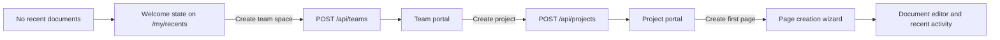

# First-Start Experience Design

## Intent

The `/my/recents` route is the application default. A new account has no document activity, so the route must provide a productive setup path rather than render the ordinary empty activity view. The first-start experience forms a deterministic progression:

## Components and state

- `RecentPagesView` derives `isWelcomeState` from an empty recent-document response and an empty local title filter. In this state, it replaces the history controls and no-result copy with the setup hero and three progress cards.
- The welcome hero presents Personal Space and Shared workspace as distinct starting modes. If a shared team already exists (for example, through membership in an existing workspace), the shared action routes to that team before offering a secondary create-space action. It also exposes the personal-space route when a personal team is present.
- `useAppStore` owns `createSpaceInitialTab`, `createSpaceTeamId`, and `createPageOpen`. These transient UI values let a portal request the existing global dialogs without duplicating creation forms or placing route state in the URL.
- `TeamPortal` requests the space dialog with `{ initialTab: 1, teamId }` for an empty team. `CreateSpaceDialog` resets its tab and selected parent team when it opens, so the call always starts on the project form for the current team.
- `ProjectPortal` sets `createPageOpen` for an empty project. `MainLayout` combines this flag with its existing page-wizard flag and resolves the target context from the current route.
- `CreatePageWizardModal` prepends three client-owned starter templates—Project Brief, Meeting Notes, and Team Wiki—to server-managed templates. They use the same Tiptap document-content payload that persisted templates use, so they do not need a seed record or API change.
- After a project has pages, `ProjectPortal` shows a compact completion card with page and member-management actions. The member action routes to `/teams/{team}/_settings?tab=members`, and `TeamSettingsView` selects its Members tab from that query parameter. Dismissal is stored per project in browser local storage under `kollab:onboarding-dismissed:{projectId}`. It is a presentation preference only; onboarding completion is never persisted to the API or used for authorization.

## Navigation and data lifecycle

`App` receives the created `Team` or `Project` response from the existing client API. It invalidates the corresponding React Query key, shows the success toast, and routes to the new team's or project's canonical abbreviation route. The document creation flow remains owned by `MainLayout`; its existing document mutation refetches the active context and navigates to the created editor.

No API contract or persistence schema changes are required. The experience relies on the existing team, project, document, and recent-document endpoints.

### API availability guardrail

The initial local-authentication startup check lists users before accepting requests. OIDC-provisioned users can have a `NULL` `users.password_hash`; `PostgresUserRepository` therefore selects `COALESCE(password_hash, '')` in all user read paths. This preserves the empty hash domain value and prevents a nullable credential from aborting API startup, which would otherwise surface in the first-start form as a browser-level fetch failure.

For local development, the backend container keeps its internal listener at port `8080` but publishes it on host port `8081`. Vite’s `/api` and `/api/ws` proxies and the localhost client fallbacks use `8081`; this reserves host port `8080` for unrelated local services. Deployments behind Caddy continue to proxy to `go-backend:8080` on the internal Docker network.

### Local-only test authentication

The development and Compose deployment configurations explicitly set `AUTH_MODE=local` and no longer pass OIDC provider variables. The existing provider implementation remains isolated behind the explicit `AUTH_MODE=oidc` server branch for a future integration, but it is inactive in this workflow and no provider service is contacted.

`GET /api/auth/config` returns the active authentication mode and current first-admin state with `Cache-Control: no-store`. The frontend uses local mode as its safe configuration fallback. This avoids stale first-run state after a database reset. `AuthGuard` renders visible `<label>` elements for username, name, email, and password; the text uses `--text-primary` and native inputs use theme tokens for their surfaces and borders. The configurable welcome sentence remains neutral; the form itself is the authoritative first-admin or sign-in instruction.

The unauthenticated screen shares `ThemeEngine` and `useAppStore` with the authenticated workspace. Its sun/moon control calls `toggleThemeMode`; both that action and `setThemeMode` save `kollab:theme-mode` in browser local storage. `ThemeEngine` supplies `--glass-bg`, `--glass-border`, and the native `color-scheme` in addition to its existing semantic color variables, so the authentication card and browser form controls are rendered consistently in either mode.

## Theme boundary

All new panels, icons, borders, hover states, and buttons use injected semantic colors and shape tokens such as `var(--primary-color)`, `var(--glass-bg)`, `var(--border-color)`, `var(--border-radius-card)`, and `var(--shadow-button)`. This preserves contrast and intent across light/dark modes and theme presets without introducing fixed color values.
