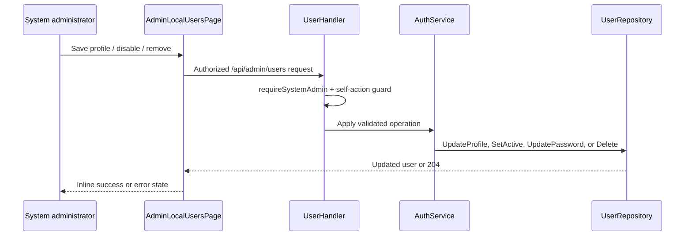

# Administration Settings Navigation and Local Users

## Status

Implemented. Server administration uses route-backed navigation instead of horizontal tabs. This removes the tab overflow failure mode and gives each setting group a stable URL.

## Route model

| Navigation item | Route | Content owner |
| --- | --- | --- |
| General | `/_admin/settings` | `ServerSettingsPage` (`general`) |
| Appearance | `/_admin/settings/appearance` | `ServerSettingsPage` (`appearance`) |
| Authentication | `/_admin/settings/authentication` | `ServerSettingsPage` (`authentication`) |
| Local users | `/_admin/users` | `AdminLocalUsersPage` |
| Audit & retention | `/_admin/settings/retention` | `ServerSettingsPage` (`retention`) |
| Document previews | `/_admin/settings/previews` | `ServerSettingsPage` (`previews`) |
| Backup & sync | `/_admin/settings/backups` | `ServerSettingsPage` (`backups`) |
| Integrations | `/_admin/settings/integrations` | `ServerSettingsPage` (`integrations`) |

`MainLayout` detects the `/_admin` route prefix and substitutes `AdminSidebar` for the document/space `Sidebar`. The normal resizer is not rendered in the administration shell. The Users item is shown only when the authenticated deployment uses `authMode=local`; its route separately redirects OIDC deployments to the main settings route.

```mermaid
flowchart LR
  Layout[MainLayout] -->|/_admin/*| AdminNav[AdminSidebar]
  Layout -->|workspace routes| WorkspaceNav[Document Sidebar]
  AdminNav --> General[/_admin/settings]
  AdminNav --> Users[/_admin/users]
  General --> Settings[ServerSettingsPage section]
  Users --> LocalUsers[AdminLocalUsersPage]
```

## Local-user API

All routes are mounted only when `JWKSCache.AllowsLocalCredentials()` is true and are protected by JWT authentication plus `system.admin` permission checks.

| Method | Endpoint | Effect |
| --- | --- | --- |
| `GET` | `/api/admin/users` | List local accounts. |
| `POST` | `/api/admin/users` | Create a local account. |
| `PUT` | `/api/admin/users/{id}` | Update `email` and `displayName`; username is intentionally immutable. |
| `PUT` | `/api/admin/users/{id}/active` | Enable or disable sign-in. |
| `PUT` | `/api/admin/users/{id}/password` | Replace the password after password-policy validation. |
| `DELETE` | `/api/admin/users/{id}` | Permanently remove a local account. |

The `domain.UserRepository` now provides `UpdateProfile` and `Delete`, implemented by both the in-memory and Postgres repositories. The Postgres implementation uses `UPDATE … RETURNING` so the UI receives the persisted profile exactly as stored.

## Safety boundaries

- A local user must satisfy the existing 12-character upper/lower/numeric password policy at creation and password reset.
- User management endpoints call `requireSystemAdmin` before reading or mutating accounts.
- The current principal cannot disable or delete its own account. This prevents the most immediate accidental administrator lockout.
- The UI requires a second explicit **Remove permanently** action in the account row; no modal is needed and the affected user remains visible while confirming.
- Account deletion relies on database foreign-key policies: authored content uses `ON DELETE SET NULL` where required, while user-scoped watch and notification records are cascaded.


