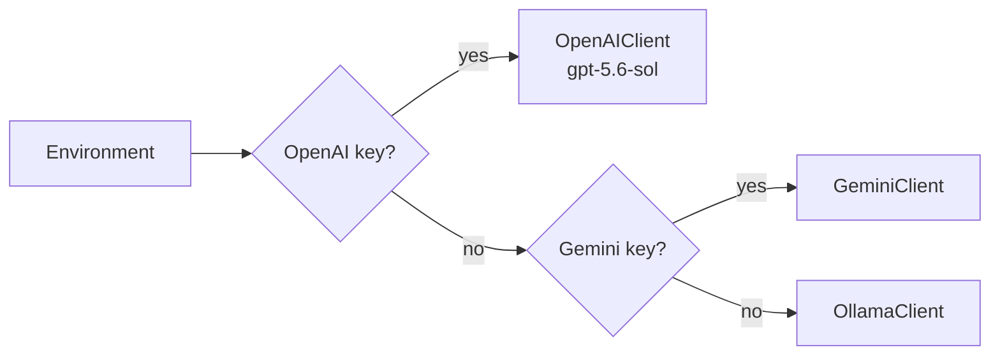
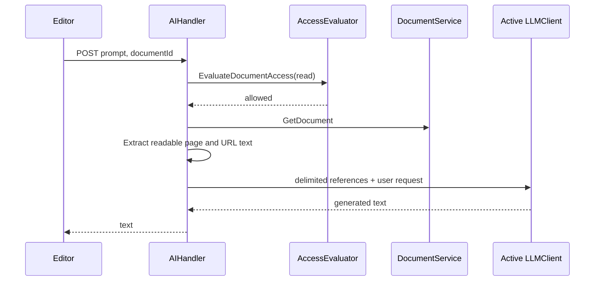

# AI assistant context and OpenAI configuration

## Provider resolution

`api/internal/ai/factory.go` resolves providers in this order:

1. OpenAI when `OPENAI_API_KEY` (or legacy `OPENAI_KEY`) is present.
2. Gemini when `GEMINI_API_KEY` (or `GEMINI_KEY`) is present.
3. Local Ollama when neither cloud provider is configured.

`OpenAIClient` defaults its text-generation model to `gpt-5.6-sol`. The model is overridden with `OPENAI_MODEL`; embeddings remain independently configurable with `OPENAI_EMBED_MODEL`. `OPENAI_BASE_URL` defaults to `https://api.openai.com/v1`, is normalized by removing a trailing slash, and is used for both `/chat/completions` and `/embeddings`. Deployments using an API-compatible gateway must include the appropriate version prefix in that base URL.

## Write-only administrator configuration

**Server Settings → General** accepts `openaiApiKey`, `openaiBaseUrl`, and `openaiModel`. The API key is accepted only on update; it is encrypted with AES-256-GCM before persistence as `openai_api_key_ciphertext` and is excluded from JSON responses. Reads return only `openaiApiKeyConfigured`. An empty key update retains the current ciphertext.

`KOLLAB_SETTINGS_ENCRYPTION_KEY` supplies the shared encryption secret for all API replicas. When it is absent, startup derives the setting key from the shared `JWT_SECRET`. `AIHandler` decrypts the ciphertext only while creating the server-side OpenAI client for a request. The browser never receives a plaintext or encrypted API key.



## Contextual generation API

`POST /api/ai/generate` accepts the existing `prompt` plus an optional `documentId`.

```json
{
  "prompt": "Summarize this page and https://example.com/announcement",
  "documentId": "doc_123"
}
```

The editor submits the active page identifier. `AIHandler.contextualPrompt` checks `read` access through `AccessEvaluator` before loading the page with `DocumentService.GetDocument`. Tiptap JSON is converted with `document.ExtractTextFromJSON`; raw document JSON is never sent to the provider. A denied or unverifiable page produces `403`, preventing a caller from using this endpoint to read a page they cannot otherwise access.

Reference material is delimited from the request and prefaced as untrusted data. Each page or URL reference is capped at 20,000 characters.



## URL ingestion boundary

The handler recognizes at most three distinct `http`/`https` URLs in the prompt. It resolves the host before the request and rejects loopback, private, link-local, multicast, unspecified, and the cloud metadata address `169.254.169.254`. Redirect targets are checked again. Requests have a ten-second timeout, use a dedicated user agent, accept successful text responses only, and read a bounded response body. HTML script and style blocks are removed before tags are stripped, whitespace is normalized, and HTML entities are decoded.

URL retrieval failures are represented as unavailable reference material rather than propagated as the remote server response. This avoids exposing private network details through the assistant endpoint.
