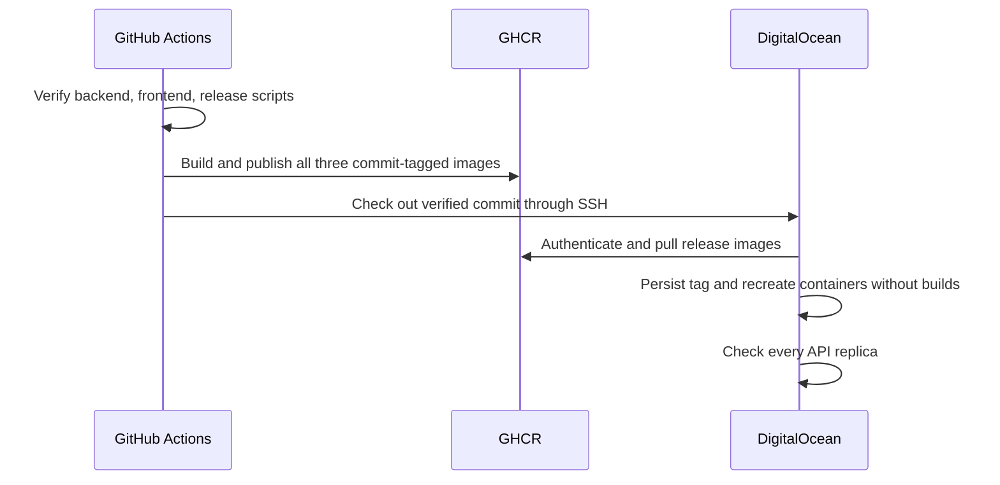

# Container releases

The production host runs prebuilt `linux/amd64` images. `.github/workflows/deploy.yml` serializes releases from `main`, reuses the verification workflow, and then builds three images on independent GitHub-hosted runners:

| Image | Build source |
| --- | --- |
| `ghcr.io/wtiger001/kollab-api:<commit>` | `api/Dockerfile`, `api/` context |
| `ghcr.io/wtiger001/kollab-caddy:<commit>` | `Caddy.Dockerfile`, repository context |
| `ghcr.io/wtiger001/kollab-media-preview:<commit>` | `WTIGER001/media-preview` at the full SHA in `media-preview.ref` |

`<commit>` is the full Kollab commit SHA, never a moving `latest` tag. OCI labels record the repository and release revision. Tags are a release convention, not a registry-enforced immutability guarantee; avoid overwriting published release tags. The converter pin is shared with local builds. Updating it requires reviewing the converter change and publishing a new Kollab release.

## Authentication boundary

The image jobs have `contents: read` and `packages: write`. The deployment job has `contents: read` and `packages: read`. Jobs use the built-in `GITHUB_TOKEN`; no registry PAT is saved in the repository or server environment. The SSH deployment forwards its masked token, logs in using standard input, and stores Docker authentication in a mode-restricted temporary `DOCKER_CONFIG` directory removed by an exit trap. Neither images nor build contexts contain `.env` or uploads. Manual private-package downloads require a separate operator login with package read access.

This follows [GitHub's container publication workflow](https://docs.github.com/en/actions/tutorials/publish-packages/publish-docker-images) and uses [Docker's GitHub Actions layer cache](https://docs.docker.com/build/cache/backends/gha/) with a separate cache scope per image.

## Deployment and failure behavior

`deploy.sh` derives `KOLLAB_RELEASE` from the checked-out Git HEAD and executes `docker compose pull` before changing containers. Production Compose contains image references and no build definitions. After successful pulls, the script atomically rewrites only the release-tag setting in `.env`, preserving other values and restricting the file to mode 0600. `up -d --no-build --pull never` cannot compile or fetch a different release during replacement. Existing volumes and extra Caddy sites remain configured.

Build/publication/download failures leave the prior containers running. Startup failures are reported without claiming success. Health checks enumerate all API containers, including stopped containers, and verify each directly. No running APIs also fails. Operators additionally verify the public `/api/health` route and authentication. Selecting an older image does not undo database migrations; rollback requires compatibility assessment and is not automatic.

## Local build

`build.sh` uses `docker buildx build --load`, defaults to `linux/amd64` and tag `local`, and builds the three images sequentially. `--platform linux/arm64` supports native ARM development; `--tag` selects a local image tag. Converter source uses its pinned Git URL. Local builds use the working tree and do not publish, deploy, or start containers. The API and frontend Dockerfiles match CI. Frontend Node has a 2 GiB heap limit and Go builds use bounded parallelism; build contexts exclude local secrets and generated files.

The script detects both `docker buildx` and Homebrew's standalone `docker-buildx` executable. This supports Colima installations without rewriting the operator's global Docker configuration. If neither is installed, it exits with installation instructions before building.

## Verification

`python3 -m unittest discover -s tests -p 'test_release_scripts.py'` exercises the scripts with a fake Docker CLI: download-before-replacement ordering, no compilation on the host, preservation of the selected release on a failed download, failure for an unhealthy or absent API, and local architecture/tag/load behavior. The reusable verification workflow runs these checks. Actual image compilation and registry access are validated by the image jobs before deployment.

See [Administrator deployment instructions](../user_guide/admin_deployment_guide.md).
