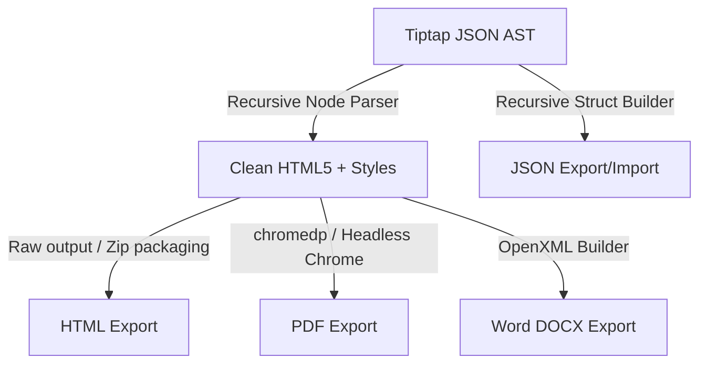

# Technical Design: Document Import & Export System

This document specifies the technical architecture, data serialization formats, and API designs for exporting and importing single pages or complete page hierarchies in Word (.docx), PDF (.pdf), HTML (.html), and JSON (.json) formats.

---

## 💾 1. Serialization Formats & Schemas

### JSON Import/Export Tree Schema
For JSON export and import, the page hierarchy is represented as a recursive tree of document nodes. This format is designed to be highly portable, omitting space-specific database identifiers (like document UUIDs) so it can be imported into any team, project, or nested page.

```json
{
  "title": "Engineering Handbook",
  "content": "{\"type\":\"doc\",\"content\":[{\"type\":\"paragraph\",\"content\":[{\"type\":\"text\",\"text\":\"Welcome to Arkollab Engineering...\"}]}]}",
  "children": [
    {
      "title": "Onboarding Guide",
      "content": "{\"type\":\"doc\",\"content\":[{\"type\":\"paragraph\",\"content\":[{\"type\":\"text\",\"text\":\"Step 1: Set up your environment...\"}]}]}",
      "children": []
    }
  ]
}
```

#### Field Specifications:
* `title` (string, required): The document title.
* `content` (string, required): A JSON string representing the Tiptap ProseMirror AST node structure.
* `children` (array of objects, optional): Nested list of subpages following the exact same schema recursively.

---

### Format Output Mapping

#### 1. Word (.docx)
* **Single Page**: Converts parsed Tiptap HTML markup into standard OpenXML WordprocessingML elements. Styles (fonts, headers, list spacing) are mapped to standard styles with modern typography (Inter/Outfit).
* **Page Hierarchy**: Renders child pages sequentially into a single consolidated Word document. Each page transition introduces a section/page break, and heading levels are shifted dynamically based on depth (e.g., `h1` at depth 2 is compiled as `h3` inside the combined document).
* **Rich Macros**:
  * *Callout Panels* are formatted as single-cell tables with a thick left border matching the callout type color (Blue/Green/Yellow/Red) and a light grey shading.
  * *Status Badges* are rendered as inline text blocks surrounded by color-coded background highlights.
  * *Task Lists* are translated to standard bullet points prefixed with uncompleted (`☐`) or completed (`☑`) checkbox characters.

#### 2. PDF (.pdf)
* **Single Page**: Compiled PDF rendered using print CSS styles.
* **Page Hierarchy**: Combined PDF where child pages are printed consecutively. Headings automatically populate the PDF's structural bookmarks/outline, creating a clickable Table of Contents inside the viewer.
* **Rich Macros**: PDF output is generated via Chrome DevTools `PrintToPDF` protocol, ensuring visual parity with the editor canvas including shaded backgrounds, border-radius elements, and inline icons.

#### 3. HTML (.html)
* **Single Page**: Standard HTML5 page containing self-contained inline CSS styles for fonts and macros, making it instantly readable offline in any browser.
* **Page Hierarchy**: Packaged as a `.zip` archive. The hierarchy is preserved as a nested directory tree:
  ```text
  /index.html (Root home document)
  /style.css  (Shared design stylesheet)
  /assets/    (Uploaded attachments and images)
  /onboarding-guide/
    /index.html (First level child document)
    /local-setup/
      /index.html (Grandchild document)
  ```
  Page links are resolved to relative directory paths (e.g. `<a href="./onboarding-guide/index.html">`) to ensure navigation works perfectly within the unzipped package.

---

## 🔌 2. REST API Endpoints

All endpoints are secured and require valid OIDC/JWT authorization headers.

### 📥 1. Export Page or Page Hierarchy
* **Endpoint**: `GET /api/documents/{id}/export`
* **Query Parameters**:
  * `format` (required): `word` | `pdf` | `html` | `json`
  * `hierarchy` (optional, default `false`): `true` | `false`
* **Responses**:
  * **200 OK**: Initiates file download with `Content-Disposition: attachment; filename="{DocumentTitle}.{ext}"`.
  * **404 Not Found**: Target document does not exist or has been soft-deleted.
  * **403 Forbidden**: User lacks read permissions for the document hierarchy.

#### Response MIME Types:
* `json`: `application/json` (or `application/zip` if hierarchy contains attachments)
* `html` (page only): `text/html; charset=utf-8`
* `html` (hierarchy): `application/zip`
* `word`: `application/vnd.openxmlformats-officedocument.wordprocessingml.document`
* `pdf`: `application/pdf`

---

### 📤 2. Import Page Hierarchy
* **Endpoint**: `POST /api/documents/import`
* **Query Parameters**:
  * `teamId` (required): Target team space ID.
  * `projectId` (optional): Target project space ID.
  * `parentId` (optional): Parent page ID to nest the imported hierarchy under.
* **Request Body**: JSON object matching the *JSON Import/Export Tree Schema*.
* **Responses**:
  * **201 Created**: Returns the metadata of the newly created top-level document.
  * **400 Bad Request**: Invalid JSON payload or missing parameters.
  * **403 Forbidden**: User lacks write access to the target workspace.

```json
{
  "id": "e229bf29-373b-4171-8bc6-52c6f1f46401",
  "title": "Engineering Handbook",
  "projectId": "p123",
  "teamId": "t456",
  "parentId": null,
  "createdAt": "2026-06-17T14:55:16Z"
}
```

---

## 🛠️ 3. Backend Converter Pipeline (Golang)

The backend conversion system utilizes a modular parser to convert Tiptap JSON into HTML, which then branches out into format-specific pipelines.



### Golang Structs for Parsing Tiptap AST
We parse Tiptap JSON content using structured types:

```go
type TiptapNode struct {
	Type    string            `json:"type"`
	Attrs   map[string]any    `json:"attrs,omitempty"`
	Content []TiptapNode      `json:"content,omitempty"`
	Text    string            `json:"text,omitempty"`
	Marks   []TiptapMark      `json:"marks,omitempty"`
}

type TiptapMark struct {
	Type  string         `json:"type"`
	Attrs map[string]any `json:"attrs,omitempty"`
}
```

### Execution Details:
1. **JSON Parser**: Walks the database documents recursively via parent-child keys, building a memory tree of `TiptapNode` objects. During import, the service traverses the payload tree, inserting records into Postgres and assigning new UUIDs parent-to-child.
2. **HTML Engine**: A recursive parser that maps nodes (`paragraph` to `<p>`, `heading` with level attribute to `<hX>`, `bulletList` to `<ul>`) and includes embedded styling rules for custom macros (Callouts, Status Badges).
3. **PDF Generation**: Runs `github.com/chromedp/chromedp` (headless Chrome driver) to load the generated HTML and call `page.printToPDF` with custom margin settings, printable background colors, and typography scaling.
4. **Word (.docx) Wrapper**: Translates Tiptap HTML tags into OpenXML formatting. Tables, lists, and headings map to Word styles. Custom macros are transformed into structured paragraphs with left borders or bullet indicators.

---

## 🖥️ 4. Frontend Integration

### Export Dialog Dialog Modal
* **Location**: Accessed via the document action menu button (Top Right of Editor Canvas).
* **Interface**:
  * Choice of export formats: Word (.docx), PDF (.pdf), HTML (.html), or JSON (.json).
  * Checkbox: **Export all subpages recursively** (only shown if the document has children).
  * Trigger: **Download Document** displays a loading spinner while downloading.

### Import Dialog Modal
* **Location**: Accessed via a split-button dropdown in the sidebar creation controls or right-clicking pages.
* **Interface**:
  * Drag & drop zone or file explorer selector accepting a `.json` file.
  * Validation: Parses the uploaded JSON schema locally and displays a preview of the hierarchy tree (number of pages and depth) before the user clicks **Confirm Import**.
