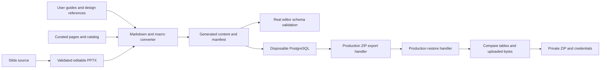

# Maintained Kollab handbook archive

The [showcase source directory](../examples/kollab-team/README.md) produces a restorable full-server `kollab.database.v2` ZIP containing a Kollab team and three projects. It exercises existing APIs, editor schemas, and restore semantics without adding an alternative import format or changing production endpoints.

## Build pipeline

## Source model and identity

`catalog.json` identifies the team, project metadata, and selected reference pages. Curated Markdown pages use stable source keys. `build.mjs` derives deterministic UUIDs from those keys and resolves `page:key`, `id:key`, and `asset:key` references before serialization. Titles can change without changing identity. Changing a key creates a new identity and requires reference review.

Ordinary Markdown becomes native Tiptap blocks and marks. A `mermaid` fence becomes a `macroBlock` with `attrs.type=mermaid`. The converter adds Mermaid configuration that disables HTML labels, retaining native SVG text labels through the application sanitizer, which intentionally removes `foreignObject`. A `kollab` fence contains an explicit native editor node, supporting containers such as `cardsGrid`, `tabsContainer`, `details`, and `layoutSection`, alongside atom macros. The converter respects code-mark exclusions and preserves text when ProseMirror normalizes adjacent text nodes.

The generated `kollab.showcase.content.v1` file is a build input, **not an import payload for a production endpoint**. It contains a closed set of authored table rows, asset source paths, hashes, and page metadata. No credentials, provider connections, or global settings are accepted from this content model.

## Materialized relationships

The builder emits teams, projects, document hierarchy, version checkpoints, page properties, review state, tags, comments, tasks, attachments, image metadata/library membership, and reusable templates. It creates the normalized property index explicitly because inserting document rows does not invoke the document-save service. An assigned task includes a textual `@username` that the current task extractor recognizes, plus a native mention for the inline user control.

Every page receives a named `Training baseline` version. Review metadata begins in draft, except the collaboration laboratory's illustrative in-review state. The package does not fabricate approvals, page-usage analytics, external issues, or AI results. Fixed September 2026 dates are illustrative source content.

Attachments use ordinary `attachments/<id>_<filename>` storage keys. The course-cover image also has an image-service original key and a team library record. Hashes bind metadata to exact source bytes. The archive test checks every stored asset after restoration.

## Archive construction and security boundary

`TestKollabShowcaseArchive` in [showcase_archive_test.go](../api/internal/http/handler/showcase_archive_test.go) initializes a disposable pgvector/PostgreSQL container with the actual migrations, permission bootstrap, and sync tracking. It deliberately accepts no database URL. Authored columns are inserted using parameterized JSON conversion, leaving omitted columns to current database defaults. A closed table allowlist constrains source insertion.

The test creates one local demo administrator with a cryptographically random password and a bcrypt hash. It assigns the standard administrator and scoped ownership roles through the permission service. No fixed demo password is committed. Private outputs use mode 0600 and an ignored `dist/` directory.

The production `SystemHandler.Backup` creates the archive. Verification changes document titles and inserts an unrelated upload, then invokes `SystemHandler.Restore` through a multipart request. It compares every exported table as canonical unordered row sets, verifies upload hashes and removal of the unrelated file, and checks the restored password and administrator role. Only a passing run writes the final ZIP, credentials, and SHA-256 checksum.

These handler calls exercise serialization and restore directly; they do not replace the separate router authorization tests or a browser integration test. No Go server needs to run for this archive verification.

## Compatibility and update policy

The archive contains the actual schema migration ledger and permission tables from the tested revision. It excludes installation coordination state according to the production exporter. Restore requires a matching table set and migration version/checksums. Rebuild after schema changes; do not relabel an old archive as compatible.

Source hashes detect stale reference pages, curated pages, catalog, converter, and slide source. Asset hashes detect a regenerated deck or image that needs content regeneration. The frontend test loads every generated document and template through the registered editor schema, checks text preservation, internal URLs, excerpt targets, attachment ownership, macro renderer availability, project names, and populated properties.

The publication workflow is one-way: Git sources generate a demonstration snapshot. A restored workspace can be edited, but it does not automatically synchronize those edits back to the repository. Scoped merge/update support is outside this package's contract.

See the [user guide](../user_guide/kollab_handbook.md) for restore and teaching instructions.
