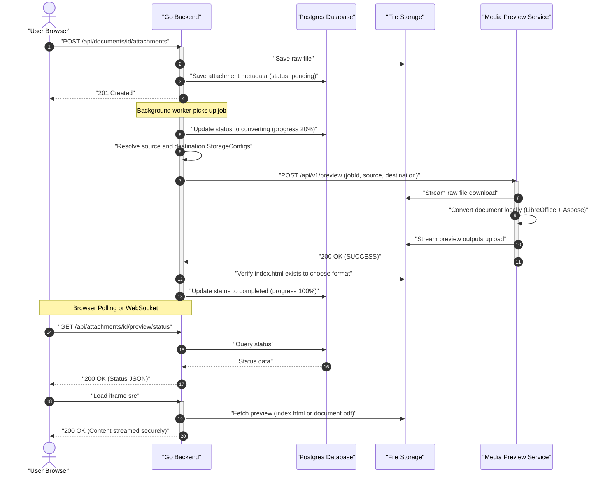
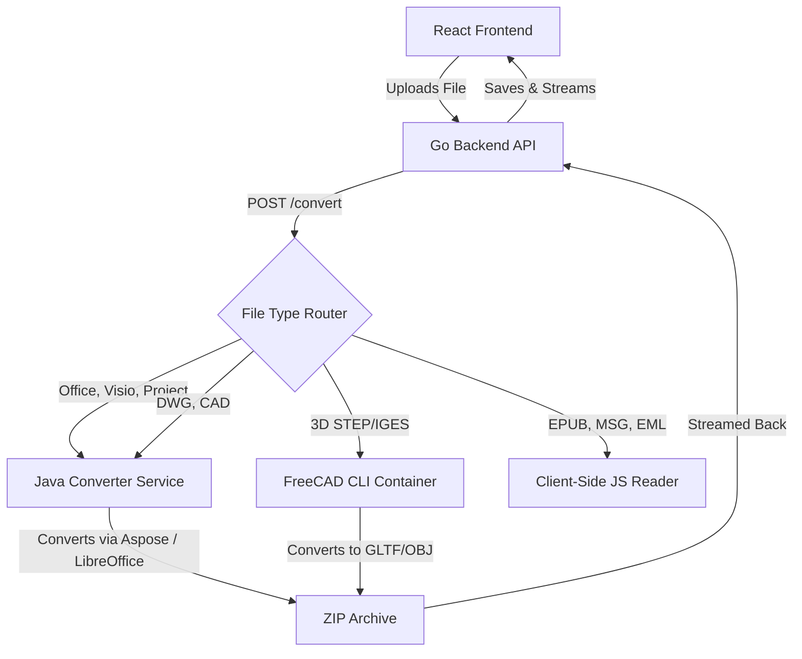

# Isolated Office Preview System Specification

This document details the architecture for isolating the Office Document Preview (Word, PowerPoint, PDF) conversion process into a dedicated microservice with a fallback mechanism and secure streaming.



---

## 1. Core Architecture

The architecture decouples file upload and backend orchestration from the resource-intensive process of document conversion:

1. **Go Backend (Orchestrator)**: Handles API routing, authorization, and job scheduling. It resolves the storage coordinates for the attachment and requests preview generation.
2. **Media Preview Service**: A standalone containerized service with LibreOffice and Aspose installed. It handles downloading the source file, converting it, uploading the outputs, and cleaning up its own local workspace.
3. **Decoupled Ingestion Flow**:
   - The Go backend triggers a conversion by sending storage descriptors (local directory paths, AWS S3 coordinates, or Azure Blob coordinates) to the Preview Service via `POST /api/v1/preview`.
   - The Preview Service directly downloads the source file from storage, performs the conversion, and uploads the generated previews (e.g. `document.pdf` and `index.html`) back to the destination prefix in storage, ensuring that the Go backend avoids memory buffering and disk caching of preview assets.

---

## 2. Key Design Areas

### A. Providing Conversion Progress

To avoid blocking HTTP request threads during long-running conversions, processing is asynchronous:

1. **Database Schema**: A dedicated `attachment_previews` table tracks progress.
   ```sql
   CREATE TABLE attachment_previews (
       attachment_id VARCHAR(255) PRIMARY KEY REFERENCES attachments(id) ON DELETE CASCADE,
       status VARCHAR(50) NOT NULL, -- 'pending', 'converting_aspose', 'converting_libreoffice', 'completed', 'failed'
       progress INT NOT NULL DEFAULT 0, -- 0 to 100
       format VARCHAR(10), -- 'html' or 'pdf'
       error_message TEXT,
       updated_at TIMESTAMP NOT NULL
   );
   ```

2. **Step-by-Step Status Updates**:
   - **0% (Pending)**: Job is added to the backend work queue.
   - **20% (Uploading)**: File is being sent to the conversion microservice.
   - **50% (Processing)**: Conversion service is converting slides or layout.
   - **80% (Storing)**: Go backend receives output ZIP and is writing resources to the storage provider.
   - **100% (Completed)**: Previews are ready for secure streaming.

3. **Status Channel**: The frontend receives status updates by polling `GET /api/attachments/{id}/preview/status` or via a real-time WebSocket connection using the existing Yjs/presence architecture.

---

### B. User-Triggered Retry

If a conversion fails (due to timeout, out-of-memory, or a temporary network glitch):

1. The frontend displays a detailed error message and a **"Retry Preview Generation"** button.
2. Clicking the button calls:
   ```http
   POST /api/attachments/{id}/preview/retry
   ```
3. The Go backend:
   - Resets the `attachment_previews` status to `pending` and `progress` to `0`.
   - Clears any previous `error_message`.
   - Re-queues the background job for processing.

---

### C. Secure Streaming (No Presigned URLs)

Since file previews may contain sensitive information, we **do not** use public S3/Blob URLs or presigned URLs. Instead, the Go backend acts as a secure streaming proxy:

1. **Preview Mount Route**:
   ```http
   GET /api/attachments/{id}/preview/view/*filepath
   ```
   - **Authentication**: This route requires standard JWT validation (either via an `Authorization` header or a short-lived query token for native iframe requests).
   - **Path Resolution**: The wildcard `*filepath` maps directly to the isolated directory inside the private storage provider:
     `previews/{id}/{filepath}`.

2. **HTML Frame Security**:
   - The React UI loads the preview inside an `<iframe src="/api/attachments/{id}/preview/view/index.html">`.
   - When the browser parses `index.html`, any relative asset references (e.g. `` or `<link href="style.css">`) are automatically requested relative to the iframe's URL path:
     `GET /api/attachments/{id}/preview/view/slide1.png`.
   - These sub-resource requests naturally carry the browser's credentials (cookies or query tokens) and are handled by the same secure Go routing handler.

---

### D. Orphan Deletion when Attachment is Deleted

To prevent storage leakage from orphaned preview files:

1. **Cascade Deletion Hook**:
   When `DELETE /api/attachments/{id}` is called:
   - The handler deletes the database record in `attachments` (which cascades to `attachment_previews` via SQL foreign keys).
   - The Go `AttachmentService` deletes the original file: `uploads/attachments/{id}_{filename}`.
   - The service recursively deletes the preview folder: `uploads/previews/{id}/`.

2. **Resilience**:
   If the storage deletion fails due to an API timeout with the storage provider:
   - The operation does not crash the client request.
   - The failure is logged, and the folder path is pushed to an asynchronous **Garbage Collection (GC) Queue** that retries the storage deletion in the background.

---

## 3. Media Preview Service Interface

The Go backend interacts with the Media Preview Service using a clean REST API. For details on the internal conversion decision logic and service configurations, refer to the [Media Preview Service Design Document](file:///Users/johnbauer/Dev/Personal/media-preview/design.md).

### API Endpoints

#### GET /api/attachments/{id}/preview/status
Returns the current preview generation state, format options, and progress.

#### POST /api/attachments/{id}/preview/retry
Re-queues the preview generation for processing.

#### GET /api/attachments/{id}/preview/view/*filepath
Streams the specified resource securely from private storage (avoiding public S3/Blob links).

---

## 5. Comprehensive Preview Strategy (Extending Beyond Office)

To build a universal knowledge management and document system, the preview architecture can be extended to handle file formats that do not have native web support. We evaluate each format across four distinct tool priorities:
1. **Priority A (Browser/React Library)**: Zero-server load, fast, processed fully client-side.
2. **Priority B (Go Library)**: Lightweight backend parsing.
3. **Priority C (Open Source CLI/Docker Converter)**: Self-hosted, free, scalable tools.
4. **Priority D (Commercial Library)**: High-fidelity, enterprise-grade tools (e.g. Aspose).

### Technology Matrix & Recommendations

| File Category | File Extensions | Priority A (React) | Priority B (Go Backend) | Priority C (Open Source CLI) | Priority D (Commercial) | Recommended Approach & UX Justification |
| :--- | :--- | :--- | :--- | :--- | :--- | :--- |
| **Word Docs** | `.docx`, `.doc` | `docx-preview` | None | LibreOffice (`soffice`) | `Aspose.Words` | **Priority D (Aspose)**: Pixel-perfect HTML preserves fonts/margins. **Priority C (LibreOffice)**: PDF fallback. |
| **Spreadsheets** | `.xlsx`, `.xls` | SheetJS / LuckySheet | `excelize` | LibreOffice (`soffice`) | `Aspose.Cells` | **Priority D (Aspose)**: Renders multi-sheet tabs and styling into clean HTML. **Priority C**: PDF fallback. |
| **Presentations**| `.pptx`, `.ppt` | None | None | LibreOffice (`soffice`) | `Aspose.Slides` | **Priority D (Aspose)**: Interactive HTML/SVG slide viewer. **Priority C**: PDF fallback. |
| **MS Visio** | `.vsd`, `.vsdx` | None | None | LibreOffice Draw | `Aspose.Diagram` | **Priority D (Aspose)**: Extracts crisp vector SVGs. **Priority C**: PDF fallback. |
| **MS Project** | `.mpp`, `.mpt` | None | None | None | `Aspose.Tasks` | **Priority D (Aspose)**: Renders Gantt charts directly to HTML/PDF. No reliable open-source CLI fallback. |
| **AutoCAD CAD** | `.dwg`, `.dxf` | `dxf-parser` + Three.js | None | `libdxfrw` / LibreCAD | `Aspose.CAD` | **Priority D (Aspose)**: High-fidelity PDF/SVG conversion on the server. **Priority A (Three.js)**: Local 2D/3D DXF viewer. |
| **3D CAD Models**| `.step`, `.stp`, `.stl`, `.obj` | Three.js loaders | None | `FreeCAD` CLI | Autodesk Forge API | **Priority A (Three.js)**: Native client-side WebGL rendering for STL/OBJ. **Priority C (FreeCAD)**: Converts STEP to GLTF. |
| **Email Files** | `.msg`, `.eml` | `msgreader` / `eml-format` | `enmime` | None | `Aspose.Email` | **Priority A (React Parsing)**: Full client-side parsing and rendering using DOMPurify for security and zero server load. |
| **E-Books** | `.epub` | `epub.js` | None | `calibre` / `pandoc` | None | **Priority A (epub.js)**: Best user experience, supports interactive font scaling, themes, and pagination. |

---

### Implementation Details by Category

#### A. CAD & 3D Models (`.dwg`, `.dxf`, `.step`, `.stl`, `.obj`)
*   **Vector CAD (2D)**:
    *   *Browser*: DXF can be read client-side using `dxf-parser` and rendered in Three.js or canvas. DWG is proprietary and requires server-side rendering.
    *   *Server*: `Aspose.CAD` converts `.dwg` to high-fidelity `.svg` or `.pdf` files.
    *   *Best UX*: Renders the CAD drawing to a vector SVG on the backend, enabling the browser to display it using standard vector zoom/pan libraries.
*   **3D Models**:
    *   *Browser*: **Three.js** provides native WebGL loaders for `.stl` and `.obj`. The user can rotate, pan, and inspect the model in real time.
    *   *Server*: STEP/IGES (`.step`, `.stp`) are complex solid geometry files. An open-source CLI converter (like a headless **FreeCAD** container) can convert them to standard `.gltf` or `.obj` files in the background, which are then loaded interactively in the browser via Three.js.

#### B. Email Formats (`.msg`, `.eml`)
*   *Browser*: Excellent libraries exist to parse email files on the client. `msgreader` parses Outlook binary files, and standard MIME parsers parse `.eml` files.
*   *Security*: Email previews are vulnerable to XSS. The extracted HTML body must be strictly sanitized using **DOMPurify** before rendering.
*   *Best UX*: React-based viewer parses header metadata (From, To, Date, Subject), builds a list of attachments that the user can download, and displays the sanitized HTML body in an iframe.

#### C. E-Books (`.epub`)
*   *Browser*: **epub.js** provides a native, highly interactive React reader. There is no need for server-side processing.
*   *Best UX*: Integrates epub.js to render the e-book in a side-by-side or paginated view with adjustable font size, light/dark themes, and search/bookmark functionality.

#### D. Unified Microservice Extension Architecture
To accommodate these formats using the same architectural pattern as the Java Office Converter, we can route incoming files to specialized conversion containers based on file extension:


