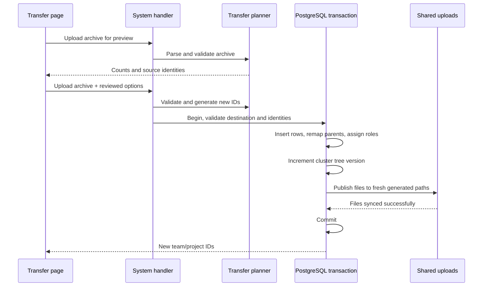

# Portable team and project transfers

The dedicated `/_admin/transfers` page supports additive cross-installation imports. It is linked from the admin sidebar and Backup & sync, and does not depend on a destination team/project route. `ScopeTransferPage.tsx` uses the existing session and query cache, with a server preview, destination form, explicit local identity mapping, and review checkbox. Changing the file clears the preview; changing any destination/mapping resets review. Busy controls prevent duplicate submissions. All custom styling uses ThemeEngine CSS variables.

## API and authorization

All endpoints require authenticated `system` write permission (server administration):

| Endpoint | Input | Result |
| --- | --- | --- |
| `GET /api/system/transfer/export?kind=team&id=…` | Team or project ID, `kind=team` or `project` | Downloadable transfer ZIP |
| `POST /api/system/transfer/preview` | Multipart `archive` | Kind, source names/abbreviations, export time, row/file counts, safe source identities |
| `POST /api/system/transfer/import` | Multipart `archive` and JSON `options` | HTTP 201 with `teamId`, optional `projectId`, and `pages` |

Example options:

```json
{
  "name": "Imported knowledge base",
  "abbreviation": "knowledge-copy",
  "teamId": "",
  "teamName": "Imported engineering",
  "teamAbbreviation": "engineering-copy",
  "ownerId": "local-user-id",
  "userMap": { "source-user-id": "local-user-id" }
}
```

An empty `teamId` creates the parent. Team archives always create a parent; project archives can target an existing shared team. Owner and mapped accounts must exist and be active. For existing teams, owner and mapped members must already belong to the destination, so project transfer cannot widen team membership. For new teams, owner, mapped members, and the authenticated importing administrator become members. The actor ID is injected from authentication and cannot be set by JSON.

Unmapped authors fall back to the owner, and unmapped memberships are omitted. New owner/editor grants use the installed `principal_roles` schema and `builtin.wiki.{team,project}.{owner,editor}` roles with `{ "id": "new-object-id" }` bindings. Source permission grants, account credentials, and sharing tokens are never replayed. Imported documents set `inheritance_broken=false`; administrators must review destination membership because old page permission exceptions are not retained.

## Archive and relationships

`api/internal/transfer` owns the versioned format, allowlisted columns, scope extraction, ZIP validation, and pure import planning. `transfer.Repository` is an optional repository capability forwarded by the system service; unsupported in-memory production repositories return an explicit error instead of a fabricated success.

```json
{
  "format": "kollab.scope.v1",
  "kind": "project",
  "createdAt": "2026-09-12T12:00:00Z",
  "tables": {
    "teams": [{ "id": "source-team", "name": "Engineering", "abbreviation": "eng" }],
    "projects": [{ "id": "source-project", "team_id": "source-team", "name": "Knowledge", "abbreviation": "knowledge" }],
    "documents": []
  },
  "users": [{ "id": "source-user", "username": "alex", "name": "Alex", "member": true }]
}
```

The ZIP contains `scope.json` plus `files/<storage-key>`. Credentials, integrations, unknown tables, and unknown columns are excluded by the explicit `Columns` allowlist. Export currently reads a consistent full database snapshot and filters it before serialization. It selects one team, its projects (or one selected project), documents including deleted records, versions, comments, attachments, referenced images, properties, reviews, publications, tasks, tags, and document/tag relationships. Team exports also select team templates and scoped image-library records. Source user entries contain only IDs, names, usernames, and membership markers. Generated preview files, collaboration state, audit logs, watches, favorites, notifications, and source ACLs are excluded.

The importer rejects unsupported formats, unsafe/duplicate ZIP paths, non-regular entries, undeclared/missing media files, unknown columns/tables, duplicate row IDs, broken scope/dependency references, cyclic page/comment parents, and invalid page JSON. Compressed and expanded input is bounded to 256 MiB and 100,000 records/entries. Parsing stages the multipart file on disk; decoded archives and media are held in memory, so this format is intended for bounded scope transfers rather than arbitrarily large backups.

Import planning creates new IDs for all scoped objects and new document slugs. Team/project landing documents retain the invariant of sharing their newly created container ID. Foreign keys, page parents, macro page/media IDs, and included page/media URLs are rewritten structurally without replacing ordinary text. Hero primary/secondary action URLs and image backgrounds follow imported page/media IDs too; unrelated external URLs remain unchanged. Source absolute URLs for included resources become local relative URLs. A project page with a parent outside the selected project is exported at root level. References outside the package and task assignee text remain unchanged and are disclosed in the UI. Existing global tags with identical names are reused without modifying destination metadata.

## Transaction and files



`PostgresSystemRepository.ImportScope` inserts allowlisted columns using parameterized values in one transaction. Page/comment parents are attached after insertion so archive ordering is irrelevant. Name/abbreviation conflicts are rejected; a scoped advisory lock serializes imports, while database unique indexes protect ordinary creation races. Unrelated records are never updated except that the shared cluster tree version advances. Comments receive the mapped local user's display name. Source publication/version relationships are preserved.

Export and import participate in the existing exclusive maintenance coordinator across replicas. Imports increment `cluster_control.tree_version` transactionally; clients discover the new tree through existing cluster updates, and the initiating UI invalidates teams/projects queries. Imported documents start with fresh collaboration state.

Files are written under `os.Root("uploads")` using generated IDs and exclusive creation, synced before database commit. No existing file is overwritten. Failed SQL rolls back new rows. A file failure rolls back the database but may leave newly generated orphan files; an ambiguous commit preserves new files because deleting them could damage a committed import. The error instructs the administrator to inspect the teams directory before retrying. Orphan cleanup is an operator action; it must confirm that an unreferenced file is not needed by a committed record. This path does not replace the upload directory or require the full-server restore recovery mechanism.

## Verification

Pure Go tests cover archive filtering, secret exclusion, ZIP validation, ID/link/file remapping, new/existing parent plans, invalid destinations, missing dependencies, and cycle rejection. PostgreSQL testcontainers tests cover real new-team/project imports, ownership grants, parent links, duplicate conflicts, global tag reuse, and transaction rollback on file failure. `runIntegrationTests` invokes the same endpoint checks against the in-memory transfer mock and real PostgreSQL. Vitest/RTL tests use mocked APIs without a backend, covering preview, new/existing parents, mapping, review reset, conflict blocking, and honest failure feedback.

See [user instructions](../user_guide/backups_and_restores.md#restore-a-team-or-project-from-another-server), [full-server backup and sync design](multi_instance_sync.md), and [cloud prototype status](18_enterprise_backups_and_azure.md).
