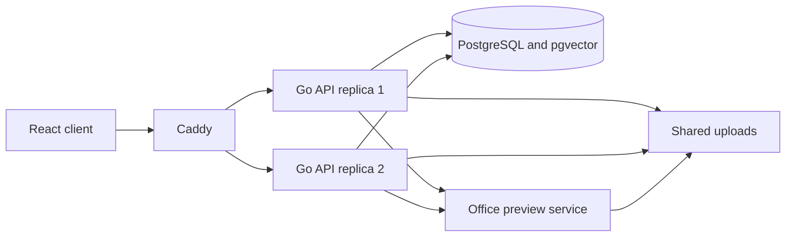

# Architecture walkthrough

Kollab separates the editor experience from the services that enforce access and persist content. The current deployment uses a shared PostgreSQL database and uploads filesystem across API replicas. Caddy balances HTTP and WebSocket connections; an established WebSocket remains on the selected process.

## Browser responsibilities

React renders route-backed workspace pages and the administration sidebar. Tiptap and ProseMirror provide a structured document tree. Yjs carries collaborative state, while custom node views render callouts, diagrams, task lists, tabs, attachment controls, and other blocks. Theme variables provide the custom UI styling contract.

The key entry points are `frontend/src/App.tsx`, `frontend/src/components/EditorCanvas.tsx`, `frontend/src/editor/extensions/`, and `frontend/src/components/MacroBlockView.tsx`. The registered extensions determine which node names the editor can accept.

## API responsibilities

The Go router wires authentication and permission middleware to resource handlers. Services implement feature rules; repositories persist their models. Database-backed permission evaluation decides whether a caller can read or change a resource. An editor hiding a control is not a security boundary.

| Layer | Role | Source entry point |
| --- | --- | --- |
| Router and middleware | Route contracts, authentication, access, maintenance gates | `api/internal/http/router.go` |
| Handlers | Decode requests and serialize responses | `api/internal/http/handler/` |
| Services | Feature behavior and derived metadata | `api/internal/document/`, `api/internal/system/` |
| Repositories | SQL, transactions, queries | `api/internal/postgres/` |
| Permissions | Space and document access evaluation | `api/internal/permissions/` |
| Collaboration | Room state and WebSocket processing | `api/internal/ws/` |

## Persistence responsibilities

The `documents` table holds readable Tiptap JSON as text and its hierarchy references. Separate tables hold versions, comments, attachments, tags, task projections, properties, and reviews. `collaborative_states` retains authoritative Yjs snapshots. PostgreSQL also stores installation coordination state and replication metadata.

Uploaded bytes live outside the database. Backup and restore therefore coordinate two resources: a relational snapshot and a filesystem tree. The recovery fence described in [Consistency and recovery](page:consistency) protects against resuming with a mixed state after an interrupted restore.

## Search and optional services

Keyword search is available without a successful embedding request. Semantic search depends on compatible embeddings and pgvector data. AI writing uses configured providers. Office previews run through the preview service; HTML export and attachment download have their own paths. See the subsystem reference pages before promising availability in a specific deployment.

## Deployment boundary

The repository's Docker Compose setup is the concrete deployment asset. Kubernetes and Azure architecture documents are reference material. Current container builds run in CI and publish images; operators deploy a selected image revision. Application schema migrations must remain immutable after deployment.
