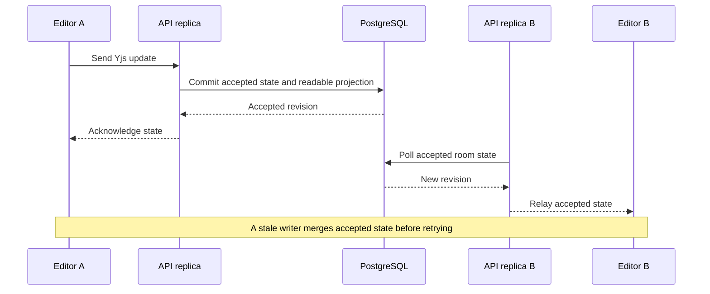
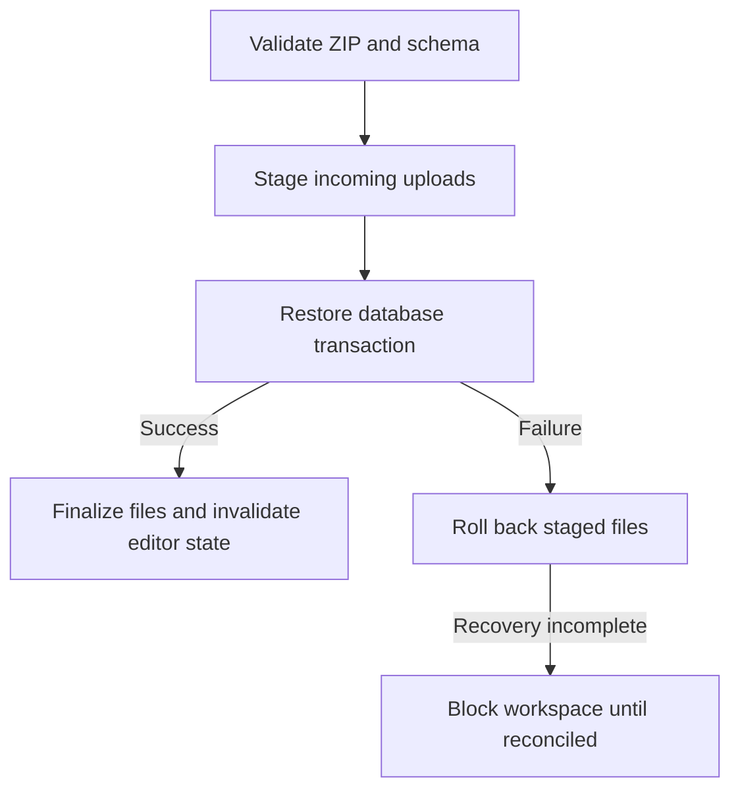

# Consistency, recovery, and synchronization

Collaboration, version restore, full-server restore, and air-gap synchronization solve different problems. This page follows their state boundaries so operators and developers can choose the correct operation.

## A collaborative edit

Browsers communicate through API replicas. Accepted collaborative state and the readable page projection commit together, keeping sharing, export, and keyword search aligned with accepted edits.

## Recovery choices

| Operation | Unit | Result |
| --- | --- | --- |
| Page version restore | One page | Replaces that page's authoritative content |
| Trash restore | Deleted content in its scope | Recovers soft-deleted content through its supported route |
| Full-server backup restore | Whole installation | Replaces application tables and uploaded files |
| Air-gap sync import | Tracked records and files | Merges changes and requires conflict review when needed |

## Full archive transaction boundary

The archive contains `database_seed.json` with `_format: kollab.database.v2`, plus the uploads tree. Database restore validates the table set and migration ledger before destructive SQL. It replaces application rows in a transaction. Installation-specific cluster records and replication identity do not travel in the archive.

File restore stages incoming uploads and retains previous bytes until the database step succeeds. PostgreSQL and the filesystem cannot commit as one native transaction. If interruption leaves a recovery directory, the application blocks further workspace operations until an administrator reconciles the outcome.

## Air-gap exchange

Sync ZIPs use `kollab.sync.v3`, with operations, uploaded files, and a signature. Trusted installations share a signing key of at least 32 bytes. Vector clocks distinguish later versions from concurrent changes; tombstones prevent older packages from resurrecting deleted records. A complete sync merges the source state and preserves unrelated destination data.

Use cursor zero for a complete exchange. Incremental cursors belong to a source/destination direction and advance only after successful import. Do not use this demonstration backup as a sync package; its file format and semantics differ.

## Verification evidence

The repository tests cover database round trips, rollback, signatures, conflict review, and replica state. The showcase adds a real-database archive test that seeds only demonstration data, exports through the production handler, changes the disposable target, restores through the production handler, and compares the resulting data and files. The artifact is therefore validated against the code that users will invoke.
