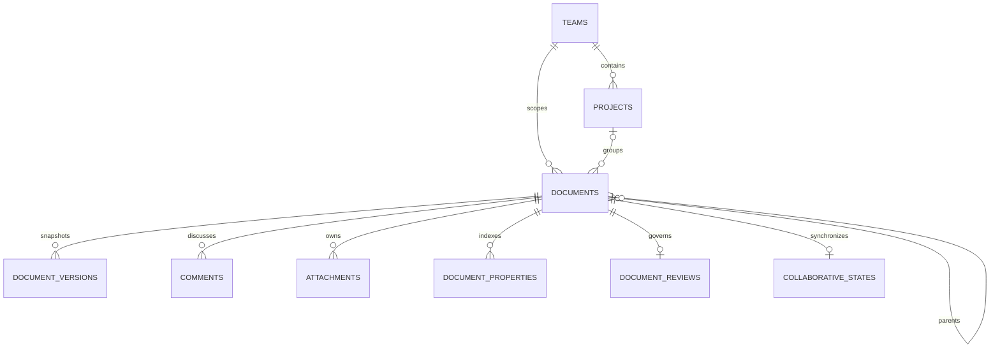

# Document model and macro contracts

Kollab persists a Tiptap document as a JSON object with `type: "doc"` and a `content` array. Each child must match a registered ProseMirror node. Arbitrary macro names do not become working features merely because they appear in JSON.

## Native blocks and atom macros

A native container owns editable child nodes. For example, `calloutPanel` accepts `block+`; `tabsContainer` accepts `tabItem+`; a `tabItem` accepts `block+`. A `macroBlock` is an atom: its `attrs.type` selects a renderer and `attrs.config` supplies renderer-specific settings.

```json
{
  "type": "doc",
  "content": [
    {
      "type": "calloutPanel",
      "attrs": {"type": "info", "title": "Implementation note"},
      "content": [{"type": "paragraph", "content": [{"type": "text", "text": "This body remains editable."}]}]
    },
    {
      "type": "macroBlock",
      "attrs": {"type": "mermaid", "config": {"code": "flowchart LR\n  Client --> API"}}
    }
  ]
}
```

## Relationships



## Representative APIs

| Request | Purpose | Boundary |
| --- | --- | --- |
| `GET /api/documents/{id}` | Read an accessible page | Document access |
| `GET /api/documents/{id}/export?format=json` | Serialize a page | Document read access |
| `GET /api/documents/{id}/review` | Read lifecycle state | Document read access |
| `PUT /api/documents/{id}/review` | Change lifecycle state | Document write access |
| `GET /api/documents/properties?projectId=…&key=Area` | Query indexed metadata | Accessible results |
| `GET /api/system/backup` | Export the complete archive | Server administration |
| `POST /api/system/restore` | Replace server data and uploads | Server administration |

## Derived projections

Page properties remain authoritative in the macro JSON; the normalized `document_properties` table supports reports. Assigned tasks derive from task-list content with user mentions and dates. These projections must be populated when constructing an archive directly. Merely inserting document rows would leave reports empty until the relevant save path runs.

The showcase builder therefore emits properties, task records, attachment metadata, review state, tags, and named version checkpoints alongside pages. The restore verification compares table contents and file hashes after a complete round trip.

## Stable references

This package assigns deterministic UUIDs to pages and assets from source keys. Cross-page links and excerpt references resolve through those IDs. Keep a page's source key when changing its title. Renaming a key creates a new identity; it is a content migration, not a cosmetic edit.

The custom macro directives in the source Markdown contain real editor nodes. They are removed during conversion and become editable native blocks in Kollab. Unsupported node names or unresolved `page:` references fail the build.
